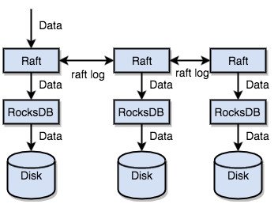
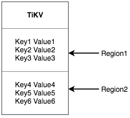
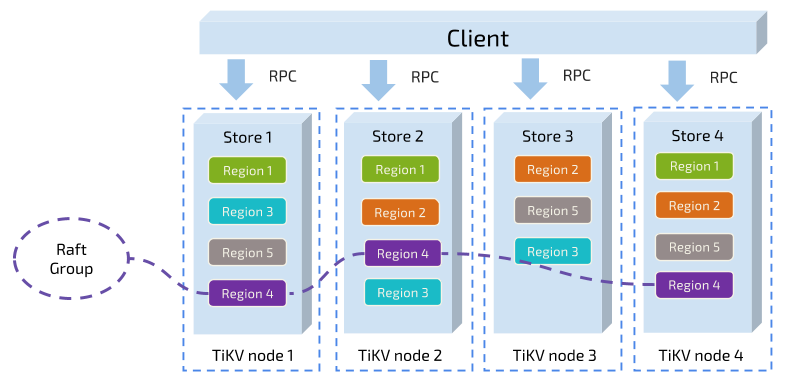

# TiDB Internal (I) - Data Storage

## Raft

Those who are interested can take a look at the Raft paper for details. This article will only give a brief introduction to Raft. The Raft paper presents a basic plan - implementing it strictly according to the paper would result in poor performance. We have made many optimizations to our Raft implementation. For specific optimization details, please refer to our chief architect's article [TiKV Source Distribution Series - Raft Optimization](https://zhuanlan.zhihu.com/p/25735592).

Raft is a consensus protocol that provides several important functions:

1. Leader election
2. Membership changes
3. Log replication

TiKV uses Raft for data replication. Each data change is recorded as a Raft log. Through Raft's log replication mechanism, the data is safely and reliably synchronized to most nodes in the Group.



To summarize: through single-machine RocksDB, we can quickly store data on disk; through Raft, we can replicate data to multiple machines to prevent single machine failures. Data is written through the Raft interface rather than directly to RocksDB. By implementing Raft, we have a distributed KV system and no longer need to worry about machine failures.

### Region

This brings us to a **very important concept**: **Region**. This concept is fundamental to understanding a series of subsequent mechanisms. Please read this section carefully.

As mentioned earlier, we view TiKV as a huge ordered KV Map. To achieve horizontal storage scalability, we need to distribute the data across multiple machines. Data distribution and Raft data replication are separate concepts. In this section, let's first forget about Raft and assume all data has only one copy - this makes it easier to understand.

For a KV system, there are two typical solutions for distributing data across multiple machines:
1. Hash the Key and choose the corresponding storage node based on the hash value
2. Divide by Range, where a continuous section of Keys is kept on one storage node

TiKV chose the second method, dividing the entire Key-Value space into many sections. Each section contains a series of continuous Keys, which we call a **Region**. We try to keep the data stored in each Region below a certain size (this size is configurable, currently defaulting to 96MB). Each Region can be described by a [StartKey, EndKey) interval.



**Note that Region here has nothing to do with SQL tables!** Please continue to think only in terms of KV.

After dividing the data into Regions, we do **two important things**:

- Scatter the Regions across all nodes in the cluster, trying to ensure each node serves a similar number of regions
- Implement Raft replication and membership management at the Region level

These two points are very important, so let's discuss them one by one.

Looking at the first point: the data is divided into many Regions by Key, and each Region's data is kept on only one node. Our system has a component that tries to distribute Regions as evenly as possible across all nodes in the cluster. This achieves both horizontal storage capacity scaling (when adding a new node, Regions from other nodes will automatically be dispatched to it) and load balancing (no nodes have too much data while others have too little). Additionally, to ensure upper-level clients can access the required data, our system also has a component that records the distribution of Regions across nodes - that is, given any Key, you can query which Region this Key belongs to and which node currently holds this Region. We'll introduce which components handle these two tasks later.

For the second point: TiKV replicates data at the Region level, meaning each Region's data will have multiple copies, which we call Replicas. Replicas use Raft to maintain data consistency (finally mentioning Raft). Multiple Replicas of a Region are kept on different nodes to form a Raft Group. One Replica serves as the Leader of the group, while other Replicas are Followers. All reads and writes go through the Leader, which then replicates changes to the Followers.

After understanding Region, you should be able to understand the following diagram:



We use Region as the unit for data sharding and replication. We now have a distributed KeyValue system with disaster recovery capabilities. We no longer need to worry about data storage or data loss due to disk failures. This is already cool, but not perfect enough - we need more functionality.

### MVCC

Many databases implement multi-version concurrency control (MVCC), and TiKV is no exception. Imagine a scenario where two Clients simultaneously modify a Key's Value. Without MVCC, the data would need to be locked. In a distributed scenario, this could lead to performance and deadlock issues.

TiKV's MVCC implementation is achieved by appending a Version to the Key. Simply put, before MVCC, TiKV could be viewed like this:

```
Key1 -> Value
Key2 -> Value
```

With MVCC, TiKV's Key arrangement looks like this:

```
Key1_Version3 -> Value
Key1_Version2 -> Value
Key1_Version1 -> Value
Key2_Version4 -> Value
Key2_Version3 -> Value
Key2_Version2 -> Value
Key2_Version1 -> Value
```

Note that for multiple versions of the same Key, we place larger version numbers in front and smaller version numbers behind (recall that Keys are arranged in order). This way, when a user queries a Value using Key + Version, we can construct the MVCC Key as Key_Version and directly locate the first position greater than this Key_Version.

### Transaction

TiKV's transactions are based on the [Percolator](https://www.usenix.org/legacy/event/osdi10/tech/full_papers/Peng.pdf) model, with many optimizations. We won't detail the transaction mechanism here - you can refer to the paper and our other articles. We'll only mention one point: TiKV's transactions are optimistic (as of May 2017). During transaction execution, write conflicts are not detected. Only during the commit process is conflict detection performed. If there are no conflicts, the commit succeeds; otherwise, the transaction needs to be retried. When there are few write conflicts in the business, this model performs very well, such as randomly updating data in certain rows of a large table. However, if there are serious write conflicts, performance will be very poor. For an extreme example, consider a counter where multiple clients modify a small number of rows simultaneously, resulting in serious conflicts and causing many invalid retries.

### Other

At this point, we've learned the basic concepts and some details of TiKV, understanding the layered structure of this distributed KV engine and how it achieves multi-copy fault tolerance. The next section will introduce how to build the SQL layer on top of the KV storage model. 
