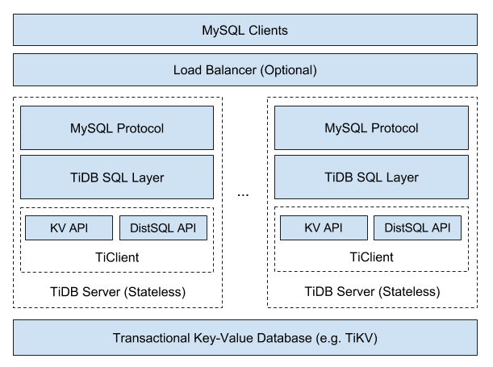
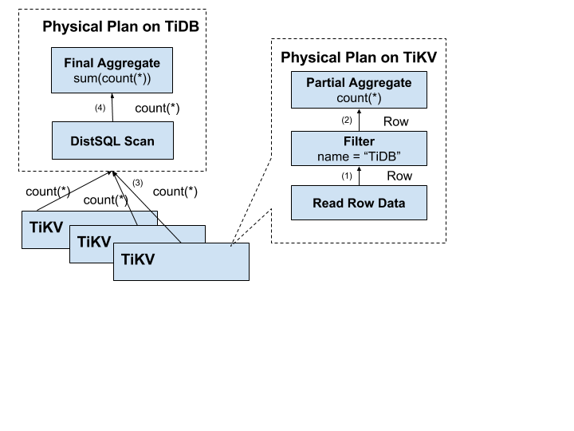
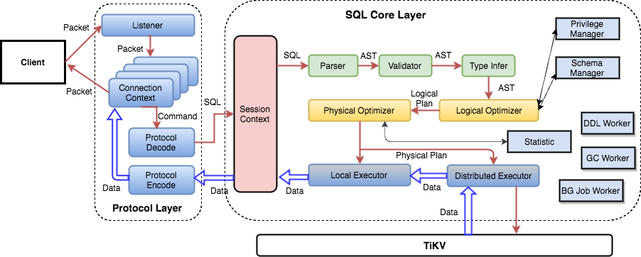

# TiDB Internal (II) - Mapping Relational Model to Key-Value Model

The previous article introduced how TiDB stores data through TiKV's basic concepts. This article will explain how TiDB maps the relational model to the Key-Value model and how SQL calculations are performed.

## Mapping Relational Model to Key-Value Model

Let's understand the relational model simply as Tables and SQL statements. The question becomes how to store Tables in a KV structure and how to execute SQL statements using this KV structure.

For a Table, there are three types of data to store:

1. Table metadata
2. Table rows
3. Index data

We'll discuss table metadata in detail in a later chapter. For row data, we can choose between row storage or column storage, each with its advantages and disadvantages. Since TiDB primarily targets OLTP workloads that need fast reading, writing, modification, and deletion of single rows, row storage is more appropriate.

For indexes, TiDB needs to support both Primary Index and Secondary Indexes. Indexes serve to assist queries, improve query performance, and ensure certain constraints. There are two query modes:

1. Point queries through Primary Key or Unique Key conditions, like `select name from user where id=1`
2. Range queries, like `select name from user where age > 30 and age < 35` using the `idxAge` index

TiDB needs to support both Unique and non-Unique indexes.

After analyzing the data storage characteristics, let's examine the operational requirements for Insert/Update/Delete/Select statements.

For Insert statements, we need to:
- Write row data to KV
- Create index data

For Update statements, we need to:
- Update row data
- Update index data (if necessary)

For Delete statements, we need to:
- Delete row data
- Delete corresponding index data

For Select statements, the situation is more complex:
- We need to quickly read individual rows, so each row needs an ID (explicit or implicit)
- We may need to read multiple consecutive rows (e.g., `Select * from user`)
- We need to read data through indexes, which may involve point queries or range queries

## TiDB's Mapping Solution

TiDB assigns:
- A unique TableID to each table
- An IndexID to each index
- A RowID to each row (if the table has an integer Primary Key, its value is used as RowID)

These IDs are all int64 types and are unique within their scope (TableID is cluster-wide unique, IndexID/RowID are table-wide unique).

### Row Data Encoding

Each row of data is encoded as a Key-Value pair according to these rules:

```
Key: tablePrefix{tableID}_recordPrefixSep{rowID}
Value: [col1, col2, col3, col4]
```

Where `tablePrefix` and `recordPrefixSep` are string constants used to distinguish data in the KV space.

### Index Data Encoding

For index data, it's encoded into Key-Value pairs following these rules:

For Unique Index:
```
Key: tablePrefix{tableID}_indexPrefixSep{indexID}_indexedColumnsValue
Value: rowID
```

For non-Unique Index:
```
Key: tablePrefix{tableID}_indexPrefixSep{indexID}_indexedColumnsValue_rowID
Value: null
```

The various prefixes in the encoding rules are string constants that help separate different namespaces to avoid conflicts between different types of data.

### Example

Let's look at a concrete example. Suppose we have a table with 3 rows:

```sql
CREATE TABLE User {
    ID int,
    Name varchar(20),
    Role varchar(20),
    Age int,
    PRIMARY KEY (ID),
    KEY idxAge (Age)
}
```

With TableID = 10 and these rows:
```
1, "TiDB", "SQL Layer", 10
2, "TiKV", "KV Engine", 20
3, "PD", "Manager", 30
```

The row data would be encoded as:
```
t_10_r_1 -> ["TiDB", "SQL Layer", 10]
t_10_r_2 -> ["TiKV", "KV Engine", 20]
t_10_r_3 -> ["PD", "Manager", 30]
```

And assuming the Age index has ID = 1, the index data would be:
```
t_10_i_1_10_1 -> null
t_10_i_1_20_2 -> null
t_10_i_1_30_3 -> null
```

## Meta Information Management

Database/Table metadata (definitions and attributes) is also stored in TiKV. Each Database/Table is assigned a unique ID that is encoded into the Key with an `m_` prefix.

TiDB uses Google F1's Online Schema change algorithm. A background process continuously checks if the Schema version stored in TiKV has changed and ensures version changes are detected within a certain period. For more details, see [TiDB's asynchronous schema change implementation](https://github.com/ngaut/builddatabase/blob/master/f1/schema-change-implement.md).

## SQL Processing on KV

### TiDB Architecture



The TiKV Cluster's main role is to store data as a KV engine. The TiDB Server layer consists of stateless nodes that process user requests and execute SQL computation logic.

### SQL Operations

After understanding how SQL maps to KV, we need to understand how to use this data to fulfill user queries. The simplest approach would be to:

1. Map SQL queries to KV queries using the mapping scheme
2. Get data through the KV interface
3. Perform computations

For example, for `Select count(*) from user where name="TiDB"`:

1. Construct Key Range: All RowIDs are in [0, MaxInt64)
2. Scan Key Range: Read data from TiKV
3. Filter data: Check if name="TiDB"
4. Calculate count for matching rows

However, this approach has several drawbacks:

1. Each row requires at least one RPC to TiKV
2. We read unnecessary rows that don't match the filter
3. We transfer unnecessary column data

### Distributed SQL Operations

To address these issues:

1. Keep computation close to storage nodes to minimize RPCs
2. Push filters down to storage nodes
3. Push aggregation and GroupBy down for pre-aggregation

Here's how data returns layer by layer:



For more details on how TiDB optimizes SQL execution, see [MPP and SMP in TiDB](https://mp.weixin.qq.com/s?__biz=MzI3NDIxNTQyOQ==&mid=2247484187&idx=1&sn=90a7ce3e6db7946ef0b7609a64e3b423).

### SQL Layer Architecture

The SQL layer in TiDB is complex with many modules and levels. Here are the key modules and their relationships:



SQL requests go through:
1. TiDB server (directly or via Load Balancer)
2. SQL parsing
3. Query plan formulation and optimization
4. Query execution
5. Data retrieval from TiKV
6. Result processing and return

## Summary

We've learned how data is stored and used for computation from an SQL perspective. Future articles will cover:
- Optimizer working principles
- Distributed execution framework details
- PD (Placement Driver) functionality for cluster management and scheduling 
