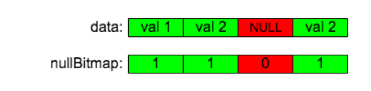
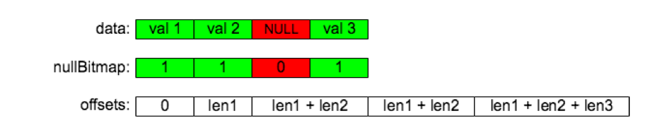
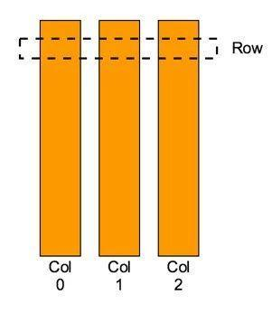
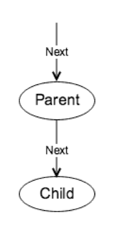
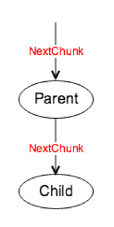

# TiDB Source Code Reading Series Part 10: Chunk and Execution Framework

By xuliwen

This article details the Chunk data structure and execution framework introduced in TiDB 2.0.

## What is Chunk?

In TiDB 2.0, we introduced a data structure called [`Chunk`](https://github.com/pingcap/tidb/blob/source-code/util/chunk/chunk.go#L32) to store internal data in memory. This was done to reduce memory allocation expenses, decrease memory occupancy, and achieve better memory usage statistics/control. 

Chunk is essentially a collection of [`Column`](https://github.com/pingcap/tidb/blob/source-code/util/chunk/chunk.go#L320) objects, responsible for storing the same type of data contiguously in memory.

### 1. Column

Column's implementation is inspired by Apache Arrow. There are two types of Column based on the data type being stored:

- Fixed-length Column: Stores fixed-length data types like `Double`, `Bigint`, `Decimal`, etc.
- Variable-length Column: Stores variable-length data types like `Char`, `Varchar`, etc.

You can see which data types use fixed-length Column and which use variable-length Column in the [`addColumnByFieldType`](https://github.com/pingcap/tidb/blob/source-code/util/chunk/chunk.go#L90) function.

The Column structure has several important fields:

- `length`: Indicates how many rows of data this Column has
- `nullCount`: Indicates how many `NULL` values are in this Column
- `nullBitmap`: Used to store whether each element in this Column is `NULL`. Note that we use 0 to indicate `NULL` and 1 for non-`NULL`, following Apache Arrow's convention
- `data`: Stores the actual data. Whether fixed or variable-length Column, all data is stored in this byte slice
- `offsets`: Used by variable-length Column to store offset information in the data slice
- `elemBuf`: Used by fixed-length Column to assist with encoding and decoding when reading or writing data

#### 1.1 Adding a Fixed Non-NULL Value

Adding an element requires calling specific append methods according to data types, such as [`appendInt64`](https://github.com/pingcap/tidb/blob/source-code/util/chunk/chunk.go#L378), [`appendString`](https://github.com/pingcap/tidb/blob/source-code/util/chunk/chunk.go#L404), etc.

A fixed-length Column can be visualized as follows:

For example, let's look at how [`appendInt64`](https://github.com/pingcap/tidb/blob/source-code/util/chunk/chunk.go#L378) adds a fixed-type value. Steps 2 and 3 are completed in the [`finishAppendFixed`](https://github.com/pingcap/tidb/blob/source-code/util/chunk/chunk.go#L372) function. Other fixed-length element operations are similar - see [`appendFloat32`](https://github.com/pingcap/tidb/blob/source-code/util/chunk/chunk.go#L388), [`appendTime`](https://github.com/pingcap/tidb/blob/source-code/util/chunk/chunk.go#L414), etc.

#### 1.2 Adding a Variable-length Non-NULL Value

A variable-length Column can be visualized as follows:

For example, let's look at how [`appendString`](https://github.com/pingcap/tidb/blob/source-code/util/chunk/chunk.go#L404) adds a variable-length value. Steps 2 and 3 are completed in the [`finishAppendVar`](https://github.com/pingcap/tidb/blob/source-code/util/chunk/chunk.go#L398) function. Other variable-length element operations are similar - see [`appendBytes`](https://github.com/pingcap/tidb/blob/source-code/util/chunk/chunk.go#L409), [`appendJSON`](https://github.com/pingcap/tidb/blob/source-code/util/chunk/chunk.go#L449), etc.

#### 1.3 Adding a NULL Value

We use [`appendNull`](https://github.com/pingcap/tidb/blob/source-code/util/chunk/chunk.go#L362) to add a `NULL` value to a Column:

- Append a 0 to the [`nullBitmap`](https://github.com/pingcap/tidb/blob/source-code/util/chunk/chunk.go#L323)
- For fixed-length Column, append one [`elemBuf`](https://github.com/pingcap/tidb/blob/source-code/util/chunk/chunk.go#L326) length of data for positioning
- For variable-length Column, don't append data but append the current data size to [`offsets`](https://github.com/pingcap/tidb/blob/source-code/util/chunk/chunk.go#L324) as the starting point for the next element

### 2. Row

As shown above, [`Row`](https://github.com/pingcap/tidb/blob/source-code/util/chunk/chunk.go#L456) in Chunk is a logical concept - the data in a Row is stored across various Columns in the Chunk. The data in the same Row is not stored contiguously in memory, and we don't need to copy data when obtaining a Row object. The Row concept exists because most arithmetic operations are based on Row-wise access and operations, such as aggregation, sorting, etc.

Row provides methods for obtaining data from Chunk, such as [`GetInt64`](https://github.com/pingcap/tidb/blob/source-code/util/chunk/chunk.go#L472), [`GetString`](https://github.com/pingcap/tidb/blob/source-code/util/chunk/chunk.go#L496), [`GetMyDecimal`](https://github.com/pingcap/tidb/blob/source-code/util/chunk/chunk.go#L563), etc. The method of obtaining data is essentially the reverse of the append data method described above.

### 3. Usage

Currently, the Chunk package only exposes Chunk and Row interfaces, not Column. Data operations are wrapped in specific functions implemented on Chunk, such as [`AppendInt64`](https://github.com/pingcap/tidb/blob/source-code/util/chunk/chunk.go#L230). Reading data uses the Getxxx functions implemented on Row, such as [`GetInt64`](https://github.com/pingcap/tidb/blob/source-code/util/chunk/chunk.go#L472).

## Execution Framework Introduction

### 1. Old Execution Framework (TiDB 1.0)

Before reconstruction, TiDB 1.0's execution framework would continuously call Child [`Next`](https://github.com/pingcap/tidb/blob/source-code/executor/executor.go#L191) function to obtain a Row composed of Datum (different from the Chunk Row introduced above). This implementation had these characteristics:

Advantages:
- Simple and easy to use

Disadvantages:
- High function call overhead when processing large amounts of data
- Large invalid memory overhead from Datum (an 8-byte integer requires 56 bytes)
- Datum objects are not reused, putting pressure on golang's GC
- Each Operator only exports one row at a time, making it difficult to perform flexible calculations and utilize CPU pipeline effectively
- Interface type data in Datum makes memory usage statistics more difficult

### 2. New Execution Framework (TiDB 2.0)

After reconstruction, TiDB 2.0's execution framework continuously calls Child [`NextChunk`](https://github.com/pingcap/tidb/blob/source-code/executor/executor.go#L198) function to get one [`Chunk`](https://github.com/pingcap/tidb/blob/source-code/util/chunk/chunk.go#L32) of data.

Characteristics:
- Each function call returns a batch of data, controlled by the `tidb_max_chunk_size` session variable (default 1024 rows)
- Child writes its produced data into Parent's [`Chunk`](https://github.com/pingcap/tidb/blob/source-code/util/chunk/chunk.go#L32)

Benefits:
- Reduced function call overhead (1/1024 of previous calls for same output)
- More efficient memory usage (8-byte integer requires ~8 bytes)
- Reduced golang GC pressure through Chunk memory reuse
- More relaxed and friendly query execution process with column-wise organization and computation
- Easier internal storage monitoring and control through [`MemoryUsage`](https://github.com/pingcap/tidb/blob/source-code/util/chunk/chunk.go#L63) function

### 3. Performance Comparison

After adopting the new execution framework, OLAP-type query execution speed and memory efficiency have greatly improved. See the [TPC-H comparison results](https://github.com/pingcap/docs-cn/blob/becd9e76878c9cf507aa626ce96de9dc6c0f85fc/v2.1/benchmark/tpch.md) for quantitative improvements.

> See more [TiDB source code reading series articles](https://cn.pingcap.com/blog/tag/tidb-source-code-reading/) 
