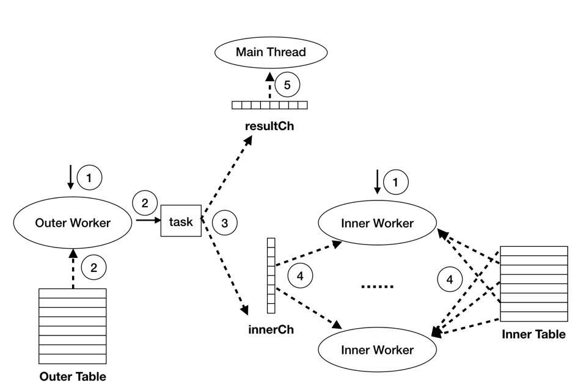
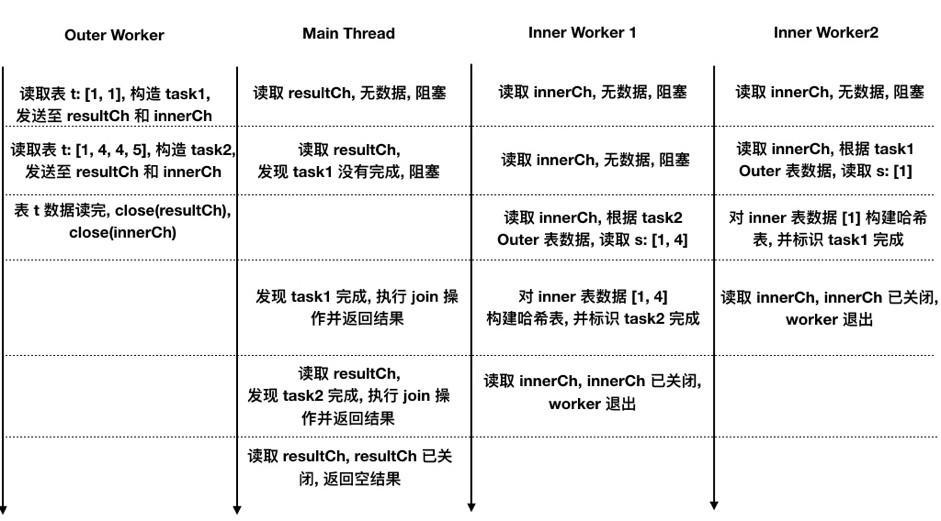

# TiDB Source Code Reading Series Part 11: Index Lookup Join Implementation

By xuliwen

In previous articles, we introduced Chunk and Hash Join. This article will continue to explain the specific implementation methods and execution processes of Index Lookup Join in TiDB.

## What is Index Lookup Join?

### Nested Loop Join

Before introducing Index Lookup Join, let's first look at what **Nested Loop Join (NLJ)** is. The specific definition can be found on [Wikipedia: Hash join](https://en.wikipedia.org/wiki/Hash_join). NLJ is the simplest brute-force Join algorithm, and its implementation process is briefly described as follows:

- Go through the Outer table and take a data row r
- Throughout the Inner table, for each data row, conduct join operation with r and output join results
- Repeat steps 1,2 until all the data in the Outer table is processed

The NLJ algorithm is very simple and the sequence of join results is consistent with the data sequence of the Outer table.

However, there are performance problems: during the implementation process, for each OuterRow, we need to conduct an Inner table **full table scan** operation, which will consume a lot of time.

To reduce the number of full-scale scanning of the Inner table, we can optimize step 1 to read a batch of data from the Outer table each time. The optimized algorithm is **Block Nested-Loop Join (BNJ)**. BNJ's specific definition can be found on [Wikipedia](https://en.wikipedia.org/wiki/Block_nested_loop).

### Index Lookup Join

For the BNJ algorithm, we notice that for each batch from the Outer table, we don't necessarily need to perform a full table scan on the Inner table. In many cases, we can reduce data reading costs by using indexes. **Index Lookup Join (ILJ)** improves upon BNJ, and its execution process is briefly described as follows:

- Take a batch of data B from the Outer table
- Construct Inner table value ranges using Join Keys and data in B, only read data within corresponding ranges, call it S
- For each row in B, execute Join operations with each row in S and output results
- Repeat steps 1, 2, 3 until all data in the Outer table is processed

TiDB's ILJ operator is a multi-threaded implementation, with the following main threads: Main Thread, Outer Worker, and Inner Workers:

**Outer Worker (one):**
- Traverses the Outer table by batch and encapsulates corresponding tasks
- Sends tasks to Inner Workers and Main Thread

**Inner Workers (multiple):**
- Read tasks built by Outer Worker
- Based on Outer table data in the task, construct Inner table scan ranges and create corresponding physical execution operators to read data within those ranges
- Create hash tables for the read Inner table data and store them in the task

**Main Thread (one):**
- Starts Outer Worker and Inner Workers
- Reads tasks built by Outer Worker and probes corresponding hash tables for each Outer row
- Performs join operations on probed data and returns execution results

This operator has the following characteristics:

- Join results order matches Outer table data order, providing order guarantees to upper-layer operators
- For each Outer table batch, only scans partial data in Inner table, improving single batch processing efficiency
- Outer table reading, Inner table reading, and Join operations execute in parallel, overall using a parallel+pipeline approach to maximize execution efficiency

### Execution Phase Details

TiDB's ILJ execution can be divided into 5 steps as shown in the following diagram:

**1. Start Outer Worker and Inner Workers**

This work is completed by the [`startWorkers`](https://github.com/pingcap/tidb/blob/source-code/executor/index_lookup_join.go#L130) function. It [starts one Outer Worker](https://github.com/pingcap/tidb/blob/source-code/executor/index_lookup_join.go#L138) and [multiple Inner Workers](https://github.com/pingcap/tidb/blob/source-code/executor/index_lookup_join.go#L141). The number of Inner Workers can be set through the `tidb_index_lookup_concurrency` system variable, defaulting to 4.

**2. Read Outer Table Data**

This work is completed by the [`buildTask`](https://github.com/pingcap/tidb/blob/source-code/executor/index_lookup_join.go#L314) function. Two main points to note:

First, regarding batch size for each read, if set to a fixed value, the following problems may occur:

- If batch value is **too large** but Outer table data volume is **small**: Task loads among Inner Workers may be uneven, causing data skew and limiting parallel performance improvement relative to single-thread
- If batch value is **too small** but Outer table data volume is **large**: Inner Workers process tasks quickly and frequently fetch from channels, leading to inefficient CPU usage and high thread switching overhead. Additionally, same Inner table data might be repeatedly read multiple times, causing higher network overhead and greatly impacting overall performance

Therefore, we dynamically control batch size through exponential increase (done by [`increaseBatchSize`](https://github.com/pingcap/tidb/blob/source-code/executor/index_lookup_join.go#L348)) to avoid these issues. Maximum batch size is controlled by session variable `tidb_index_join_batch_size`, defaulting to 25000. The read batch is stored in [`lookUpJoinTask.outerResult`](https://github.com/pingcap/tidb/blob/source-code/expression/chunk_executor.go#L225).

Second, if Outer table has filter conditions, we need to filter data in outerResult (done by [`VectorizedFilter`](https://github.com/pingcap/tidb/blob/source-code/expression/chunk_executor.go#L225)). Since outerResult is Chunk type (see [TiDB Source Code Reading Series Part 10](https://cn.pingcap.com/blog/tidb-source-code-reading-10/)), extracting and rebuilding objects for rows meeting filter conditions would cause unnecessary time and memory overhead. The `VectorizedFilter` function uses a bool slice equal in length to outerResult's actual row count to record whether each row meets filter conditions, avoiding this overhead. This bool slice is stored in [`lookUpJoinTask.outerMatch`](https://github.com/pingcap/tidb/blob/source-code/executor/index_lookup_join.go#L81).

**3. Outer Worker Sends Tasks to Inner Workers and Main Thread**

Inner Workers need to construct Inner table data scan ranges based on each Outer table batch's data and read data, so Outer Worker needs to [send tasks to Inner Workers](https://github.com/pingcap/tidb/blob/source-code/executor/index_lookup_join.go#L304).

As mentioned earlier, ILJ executes multi-threaded concurrently while maintaining Join result order matching Outer table data order. To achieve this, Outer Worker [sends tasks to Main Thread](https://github.com/pingcap/tidb/blob/source-code/executor/index_lookup_join.go#L299) through channels, and Main Thread reads tasks sequentially from channels to execute Join operations, thus maintaining order requirements under concurrent execution.

**4. Inner Workers Read Inner Table Data**

This work is completed by the [`handleTask`](https://github.com/pingcap/tidb/blob/source-code/executor/index_lookup_join.go#L376) function. After completing these steps, Inner Workers send data to `task.doneCh` to wake up Main Thread for subsequent work.

**5. Main Thread Executes Join Operations**

This work is completed by the [`prepareJoinResult`](https://github.com/pingcap/tidb/blob/source-code/executor/index_lookup_join.go#L209) function, with the following steps:

- [`getFinishedTask`](https://github.com/pingcap/tidb/blob/source-code/executor/index_lookup_join.go#L216) reads task from resultCh and waits for data sent to task.doneCh, blocking if task isn't complete
- Similar to Hash Join (see [TiDB Source Code Reading Series Part 9](https://cn.pingcap.com/blog/tidb-source-code-reading-9/)), [`lookUpMatchedInners`](https://github.com/pingcap/tidb/blob/source-code/executor/index_lookup_join.go#L273) takes Join Key for one OuterRow and probes corresponding Inner table data from task.lookupMap
- Main thread performs Join operations between that OuterRow and retrieved InnerRows, returning when result storage chk is full

## Example

In the above example, `t` is the Outer table and `s` is the Inner table. The [/*+ TIDB_INLJ */](https://docs.pingcap.com/zh/tidb/v3.0/optimizer-hints#tidb_inljt1-t2) hint tells the optimizer to choose the Index Lookup Join algorithm when possible.

The initial Outer Table batch reading size is 2 rows, and there are 2 Inner Workers.

A possible execution flow of the query statement is shown in the figure below, where arrows from top to bottom indicate timeline:

> See more [TiDB source code reading series articles](https://cn.pingcap.com/blog/tag/tidb-source-code-reading/) 
