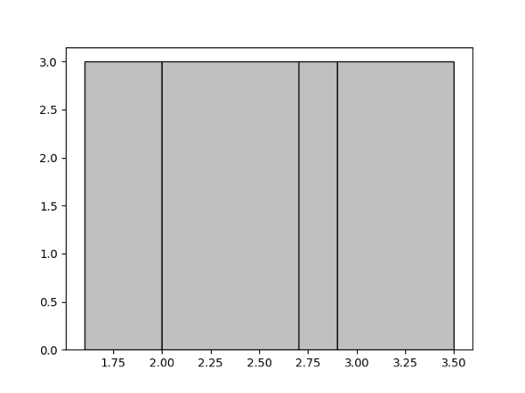
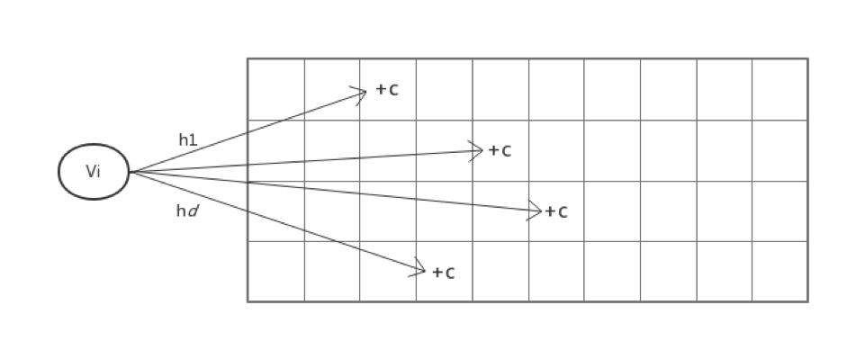

# TiDB Source Code Reading Series Article: Statistical Information

This article introduces the basic concepts of statistical information, TiDB's statistical information collection/update mechanism, and how to use statistical information to estimate the cost of calculations. We'll focus on the principles first, with a follow-up article covering the TiDB source code implementation.

## Introduction

In TiDB, SQL optimization can be divided into two parts: logical optimization and physical optimization. During physical optimization, it's necessary to estimate the operating cost of calculations in the logical query plan and choose the least expensive query path as the final plan. Statistical information is the core module enabling this estimation process.

Due to the complexity of this topic, it will be covered in two articles:
1. This article: Basic concepts, collection/update mechanisms, and cost estimation
2. Next article: Detailed source code implementation

## What is Statistical Information

To determine query execution costs, the simplest approach would be to actually implement each query plan. However, this would defeat the purpose of the optimizer. The optimizer doesn't need exact costs - it only needs estimates to differentiate between more and less efficient execution plans. Therefore, databases typically maintain summary information about actual data for rapid cost estimation - this is statistical information.

In TiDB, we maintain statistics including:
- Total number of table rows
- Histogram data
- Number of NULL values
- Average length
- Number of distinct values

Let's explore two key components: Histograms and Count-Min Sketch.

### Histogram Introduction

Histograms are tools for describing data distribution. They divide data into buckets based on value ranges and use simple metrics to describe each bucket, such as the number of values falling within it. Most databases use histograms to estimate interval queries. Common histogram types include equal-width and equal-height histograms.

TiDB uses equal-height histograms, as proposed in the 1984 paper ["Accurate estimation of the number of tuples satisfying a condition"](https://dl.acm.org/citation.cfm?id=602294). Compared to equal-width histograms, equal-height histograms provide better worst-case error guarantees. An equal-height histogram ensures that each bucket contains approximately the same number of values.

For example, given the set {1.6, 1.9, 1.9, 2.0, 2.4, 2.6, 2.7, 2.8, 2.9, 3.4, 3.5} and 4 buckets, the resulting histogram would look like:

### Count-Min Sketch

Count-Min Sketch (CMS) is a data structure for handling equality queries, join size estimates, and more, providing strong accuracy guarantees. Introduced in the 2003 paper ["An improved data stream summary: The count-min sketch and its applications"](http://dimacs.rutgers.edu/~graham/pubs/papers/cm-full.pdf), it has become widely used due to its simplicity in creation and usage.

CMS maintains a d*w counting array. For each value, d independent hash functions map to one column in each row, modifying the count at these d positions:

When querying how many times a value has appeared, the same d hash functions find the positions in each row, and the minimum value among these d positions serves as the estimate.

For more related technologies, refer to "Synopses for Massive Data: Samples, Histograms, Wavelets, Sketches".

## Statistical Information Creation

### Creating Histograms

When creating histograms, data ordering is required, but sorting costs can be high. TiDB implements a sampling algorithm that:
1. Samples data in each region
2. Sorts the samples
3. Creates histograms from the sorted samples

The sampling algorithm uses reservoir sampling with a sample pool size S. For a data stream of size n, elements are selected into the sample with probability S/n. If the sample set exceeds S, a random sample is removed.

After sampling, the data is sorted. Since we know the total row count and desired number of buckets post-sampling, we can determine each bucket's depth. Values are then assigned to buckets sequentially:
- If a value equals the previous value, it goes in the same bucket regardless of fullness
- Otherwise, it goes in the current bucket if not full, or the next bucket if full

### Index Histogram Creation

For index histograms, we can't predetermine bucket depths since we don't know the data volume in advance. However, since index data is already ordered, we use a different algorithm:
1. Set initial bucket depth to 1
2. Insert data using the previous method
3. If required buckets exceed current depth, double the depth and merge previous buckets pairwise
4. Continue insertion

After collecting histograms from each region, they must be merged. For adjacent regions' histograms, the upper bound of one won't exceed the lower bound of the next due to index ordering. To ensure values appear in only one bucket, boundary buckets with equal bounds must be merged first. If the merged histogram exceeds the bucket limit, adjacent buckets are combined pairwise.

## Statistical Information Maintenance

In version 2.0, TiDB introduced a dynamic update mechanism (default off in 2.0, default on in 2.1-beta) to adjust statistics based on query results. This involves:
- For histograms: Adjusting bucket heights and boundaries
- For CM Sketch: Adjusting the counting array to match query results

### Bucket Updates

For range queries, buckets may contribute errors to the final result. The update method assumes even error distribution across buckets. If the estimated result is E, actual result is R, and a bucket's estimated result is b = bucket height h * coverage ratio r, then the bucket height is adjusted to (b/r) * (R/E) = h * (R/E).

However, if we can determine actual results within each bucket's range, we don't need to assume even error distribution. To achieve this, we split query ranges into non-overlapping parts based on bucket boundaries, allowing TiKV to count actual rows in each range. This enables accurate per-bucket error correction.

### Bucket Boundary Updates

When estimating with histograms, errors mainly come from the continuous average distribution assumption for buckets only partially covered by the query range. Boundary updates aim to make query boundaries fall as far as possible from bucket boundaries. This involves both splitting and merging operations.

For splitting:
- Determine which buckets to split and how many times based on query point frequency
- Choose split boundaries to minimize the sum of distances to query points

For merging:
- Never merge newly split buckets
- Consider merging consecutive buckets where the error after merging would be minimal

### Count-Min Sketch Updates

CM Sketch updates are straightforward. For an equality query feedback result x with estimated value y, we add c = x-y to all points involved in this value.

## Using Statistical Information

Statistical information primarily helps estimate result sizes after filtering conditions to optimize query plans. The count in TiDB's EXPLAIN output shows the expected number of rows output by each operator, based on statistical information and operator logic.

### Range Queries

For range queries on a column, TiDB uses equal-height histograms. Consider our earlier example with four buckets [1.6, 1.9], [2.0, 2.6], [2.7, 2.8], [2.9, 3.5]. To estimate values in [1.7, 2.8]:
1. Two buckets are fully covered: [2.0, 2.6] and [2.7, 2.8]
2. For partially covered [1.7, 1.9], assume uniform distribution: (1.9-1.7)/(1.9-1.6) * 3 = 2

For non-numeric types like strings, TiDB maps them to numbers for ratio calculations. See [statistics/scalar.go](https://github.com/pingcap/tidb/blob/source-code/statistics/scalar.go) for details.

### Equality Queries

For equality queries, TiDB uses Count-Mean-Min Sketch, an improvement over basic CM Sketch proposed in ["New estimation algorithms for streaming data: Count-min can do more"](http://webdocs.cs.ualberta.ca/~drafiei/papers/cmm.pdf).

It operates the same as CM Sketch for updates but differs in querying:
- For each row i with hash mapping to value j, estimate noise as (N - CM[i,j])/(w-1)
- Use CM[i,j] - (N - CM[i,j])/(w-1) as the row's estimate
- Take the median of all row estimates as the final estimate

### Multiple Queries

Real queries often involve multiple conditions across multiple columns. TiDB's `Selectivity` function in selectivity.go handles this, providing the main interface between statistics and the optimizer.

For multi-column conditions, a common approach assumes independence between columns and multiplies their individual filtration rates. However, for conditions on index columns that can form index scan ranges (e.g., `(a, b, c)` index with conditions like `a = 1 AND b = 1 AND c < 5` or `a = 1 AND b = 1`), we can estimate directly after encoding index values, avoiding independence assumptions.

The `Selectivity` function's key tasks are:
1. Divide conditions into minimal groups where each group can use column/index statistics
2. Minimize independence assumptions between groups
3. Combine estimates using independence assumptions only when necessary

[Click to see more TiDB source code reading series articles](https://cn.pingcap.com/blog/tag/tidb-source-code-reading/) 
