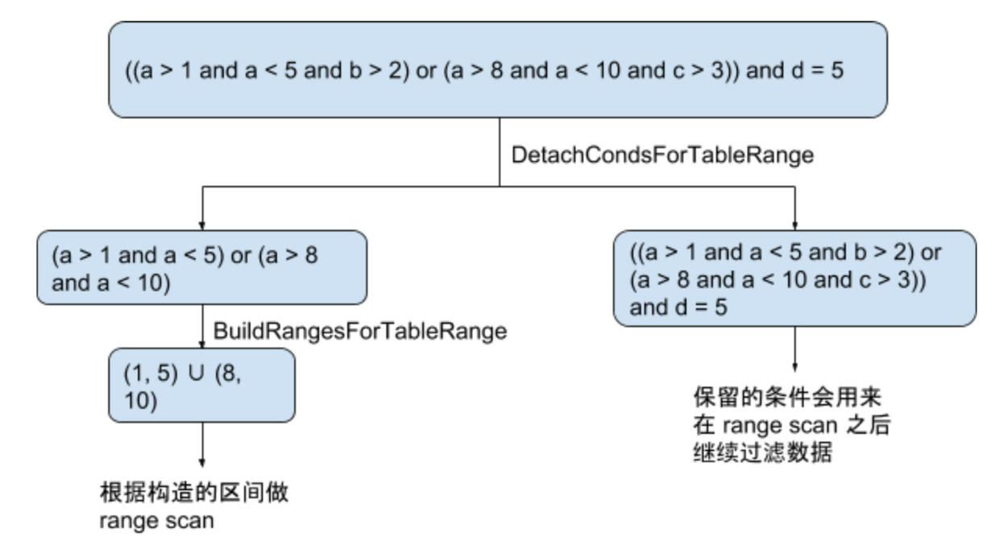

# TiDB Source Code Reading Series Article: Range Calculation

This article details how TiDB analyzes complex screening conditions to obtain the logical range (range) of the corresponding index of these conditions.

## Brief Description

When processing query requests in the database, filtering out irrelevant data as early as possible allows subsequent calculations to do less unnecessary work and improves the execution efficiency of the entire SQL query. The most commonly used means of filtering data is using an index. TiDB's optimizer will use index filtering to process requests whenever possible, leveraging the ordered characteristics of the index to improve query efficiency. For example, when the query condition is `a = 1` and column a is indexed, we can use the index to quickly retrieve data satisfying `a = 1` without having to check line by line whether a value is 1. Of course, whether index filtering will be chosen also depends on the cost estimate.

The index is divided into single indexes and multiple indexes (combined indexes), and screening conditions are often not simple equivalent conditions but may be very complex combinations. This article introduces how TiDB analyzes these complex conditions to obtain the logical range of these conditions on the corresponding index.

**Note: Readers should have a basic understanding of how TiDB builds and stores index data (reference reading: [Three articles to understand TiDB technology inside - Computation](https://cn.pingcap.com/blog/tidb-internal-2/))**

Here's an example to demonstrate what index range calculation means. Consider the following flow:

As shown in the diagram above, the entire process is divided into two steps:
1. Extracting expressions that can use the available index from Filter
2. Constructing the data range using the selected expressions

Let's explore each step in detail.

## Extract Expression

This step selects expressions from Filter that can utilize indexes. Since the processing logic differs significantly between single indexes and multiple indexes, we'll explain each case separately.

### Single Index

The situation with a single index is relatively simple. Many simple expressions in the form of Column op Constant can be used to calculate range. The judgment logic for a single expression is in [checker.go](https://github.com/pingcap/tidb/blob/source-code/util/ranger/checker.go) ConditionChecker. For complex situations that include AND or OR, we handle them according to the following rules:

1. AND expressions:
   - Filter expressions don't affect their sub-items that can calculate range
   - Simply discard irrelevant expressions
   - For example, in `a > 1 and a < 5 and b > 2`, we just discard `b > 2` and keep `a > 1 and a < 5`

2. OR expressions:
   - Each sub-item must be able to calculate range
   - If any sub-item cannot calculate range, the entire expression cannot be used
   - For example, `a = 1 or b = 2` cannot be used since `b = 2` cannot calculate range for index a
   - For `a > 10 or (a < 2 and b = 1)`, following rule 1, the second sub-item keeps only `a < 2`, so the entire expression becomes `a > 10 or a < 2` for range calculation

Note that TiDB's primary keys have implementation limitations. Only integer type single keys will use the RowID value as the primary key and encode it into RowKey stored with the row data. Other types of single keys are treated as ordinary unique keys. When queried columns contain columns not on the index, a search index is required. We've extracted this integer type primary key index processing logic separately, with the entry function being [DetachCondsForTableRange](https://github.com/pingcap/tidb/blob/source-code/util/ranger/detacher.go#L329). The processing entries for AND and OR expressions are [detachColumnCNFConditions](https://github.com/pingcap/tidb/blob/source-code/util/ranger/detacher.go#L28) and [detachColumnDNFConditions](https://github.com/pingcap/tidb/blob/source-code/util/ranger/detacher.go#L61).

### Multiple Index

For multiple indexes, when dealing with AND expressions, according to the previous rules, their form must be equivalent conditions on the index prefix plus complex conditions on columns after the prefix. We only need to process the equivalent conditions part in order and append the range of point checks to LowVal and HighVal in NewRange ([appendPoints2Ranges](https://github.com/pingcap/tidb/blob/master/pkg/util/ranger/ranger.go#L133)). When dealing with the last column, copy the previous NewRange by the number of intervals calculated by the last non-point check, and then append them in sequence. Specific code can be found in [buildCNFIndexRange](https://github.com/pingcap/tidb/blob/master/pkg/util/ranger/ranger.go#L282).

For OR expressions, the range can no longer be transferred back to the point structure. Here, the interval operation was re-implemented. The implementation sorts intervals by the left endpoint and, while sweeping sequentially, records the right endpoint of all currently overlapping intervals to perform interval union operations. The specific implementation can be found in the [unionRanges](https://github.com/pingcap/tidb/blob/master/pkg/util/ranger/ranger.go#L357) method.

## Future Plans

1. TiDB's treatment of single indexes is very complete in logic, though actual performance may be limited due to missing range calculation logic for some functions. This will be optimized as needed.

2. As mentioned, TiDB currently makes some assumptions about multiple indexes to simplify ranger logic. Future work will:
   - Remove or weaken these assumptions
   - Improve SQL rewriting to avoid triggering these assumptions
   - Provide more powerful functions while avoiding manual rewrites

3. Currently, TiDB's inspection of simple forms is limited to Column op Constant. Conditions like `from_unixtime(timestamp_col) op datetime_constant` cannot use indexes and require manual rewriting as `timestamp_col op timestamp_constant`. This area will be improved to enhance user experience.

[Click to see more TiDB source code reading series articles](https://cn.pingcap.com/blog/tag/tidb-source-code-reading/) 
