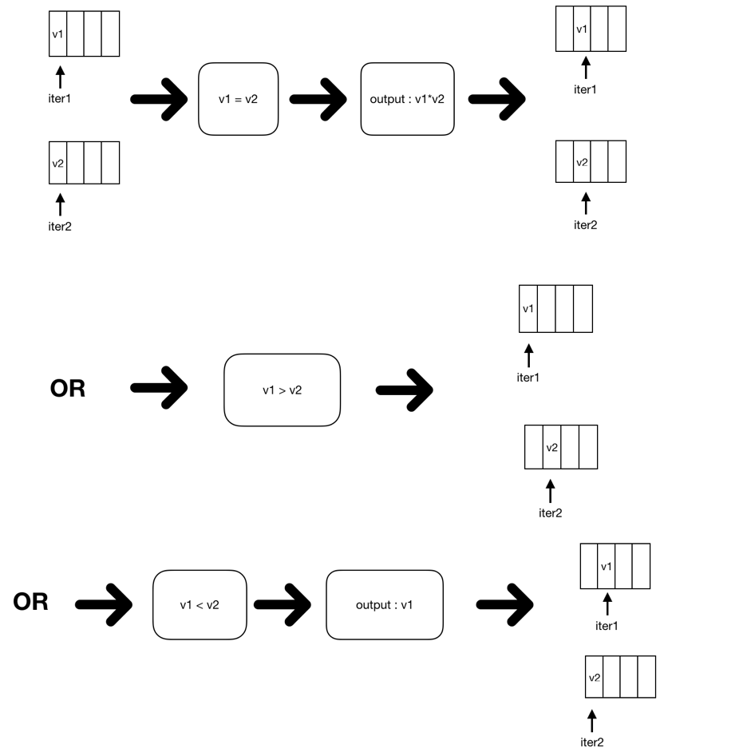

# TiDB Source Code Reading Series Article: Sort Merge Join Implementation

This article introduces Sort Merge Join's implementation in TiDB.

## What is Sort Merge Join

Before diving into the source code, let's understand what Sort Merge Join (SMJ) is. The definition can be found on [Wikipedia](https://en.wikipedia.org/wiki/Sort-merge_join). In simple terms, the two tables being joined are first sorted according to their join attributes, then merged through a scan to obtain the final result. The biggest overhead of this algorithm is sorting internal and external data. However, when the join columns are indexed, we can use the index's ordering to avoid the sorting overhead. Therefore, in the query optimizer, SMJ is typically considered when join columns are indexed.

### Execution Process

TiDB's implementation code is in [tidb/executor/merge_join.go](https://github.com/pingcap/tidb/blob/source-code/executor/merge_join.go), with `MergeJoinExec.NextChunk` being the entry point for this operator. Using `SELECT * FROM A JOIN B ON A.a = B.a` as an example, here's a brief description of the SMJ implementation process, assuming table A is the outer table, table B is the inner table, and join-key is column 'a' which is indexed in table B:

1. Read the outer table A in order until a different join-key value appears, group rows with the same keys into groups a1. Similarly, read the inner table B and group rows with the same keys into groups a2. If either outer or inner table reading is complete, exit.

2. Read the current first row from a1 and set it as v1. Read the current first row from a2 and set it as v2.

3. Compare v1 and v2 based on join-keys, with several possible outcomes:
   - If cmpResult > 0, meaning v1 is greater than v2, discard the current a2 data, read the next batch from the inner table using the same method as step 1, and repeat step 2.
   - If cmpResult < 0, meaning v1 is less than v2, indicating no inner table match for outer row v1, send the outer data to resultGenerator (different join types handle unmatched data differently, e.g., outer joins will output unmatched outer rows).
   - If cmpResult == 0, meaning v1 equals v2, join all rows in a1 with rows in a2 and output to resultGenerator.

4. Return to step 1.

The following diagram illustrates the SMJ process:

### Reading Inner/Outer Table Data

We use `fetchNextInnerRows` or `fetchNextOuterRows` to read inner and outer data respectively. These functions perform similar tasks; we'll focus on explaining the `fetchNextInnerRows` implementation.

The `MergeSortExec` operator reads data through the `readerIterator` iterator, which provides sequential data access. `MergeSortExec` maintains two readerIterators: `outerIter` and `innerIter`, constructed in the `buildMergeJoin` function.

The actual data reading is done by `readerIterator.nextSelectedRow`, which uses `ri.reader.NextChunk` to read a chunk of data at a time. For more about Chunk, see our previous article [TiDB Source Code Reading Series Article: Chunk and Execution Framework](https://cn.pingcap.com/blog/tidb-source-code-reading-10/).

Notably, we use `expression.VectorizedFilter` to filter outer data, returning a curSelected boolean group to determine which outer rows meet the filter conditions. For example, in `select * from t1 left outer join t2 on t1.a=100;`, the filter is `t1.a=100`. For rows that don't pass this filter, we use `ri.joinResultGenerator.emitToChunk` to send them to resultGenerator. This resultGenerator interface determines output based on join type - outer joins output unmatched rows, inner joins ignore them. For more about resultGenerator, see [TiDB Source Code Reading Series Article: Hash Join](https://cn.pingcap.com/blog/tidb-source-code-reading-9/).

`rowsWithSameKey` continuously reads next rows through `nextSelectedRow`, checking if each row's join-keys belong to the same group. If so, it groups rows with the same join-keys separately into `innerChunkRows` and `outerIter4Row`. Then it builds iterators innerIter4Row and outerIter4Row. During SMJ execution, these iterators provide data for actual comparison to get join results.

### Merge-Join

The Merge-Join logic is implemented in function `MergeJoinExec.joinToChunk`, comparing current data from inner and outer iterators based on their join-keys:

- If cmpResult > 0, meaning outer data is greater than inner data, read next inner table data via `fetchNextInnerRows` and compare again.

- If cmpResult < 0, meaning outer data is less than inner data, handle based on join type. For outer joins, output outer data + NULL; for inner joins, ignore outer data. This logic is controlled by `e.resultGenerator` - we just call `e.resultGenerator.emitToChunk` with the outer data. Then read next outer data via `fetchNextOuterRows` and compare again.

- If cmpResult == 0, meaning outer data equals inner data, join outer data with current inner data using `e.resultGenerator.emitToChunk` to generate results. Then get next data from both tables and restart comparison.

Repeat this process until either outer or inner data is exhausted, then exit Merge-Join.

### Further Optimizations

Our analysis above is based on the [source-code](https://github.com/pingcap/tidb/tree/source-code) branch. You may have noticed potential issues, such as reading all rows with the same key at once for both inner and outer tables. If there are many rows with the same key, this risks memory OOM. In the latest master branch, we've made several optimizations:

1. The outer table doesn't need to read all same-key rows at once. We can process outer rows one by one against the inner table group, significantly reducing OOM risk.

2. For the inner table, we use `memory.Tracker` to track intermediate result memory usage. If it exceeds our threshold, we'll log output or terminate SQL execution to prevent OOM. We'll cover `memory.Tracker` in future source code analysis articles.

In the future, we'll implement more Merge-Join optimizations, such as multiple merges and intermediate result caching. Stay tuned!

> [Click to see more TiDB source code reading series articles](https://cn.pingcap.com/blog/tag/tidb-source-code-reading/) 
