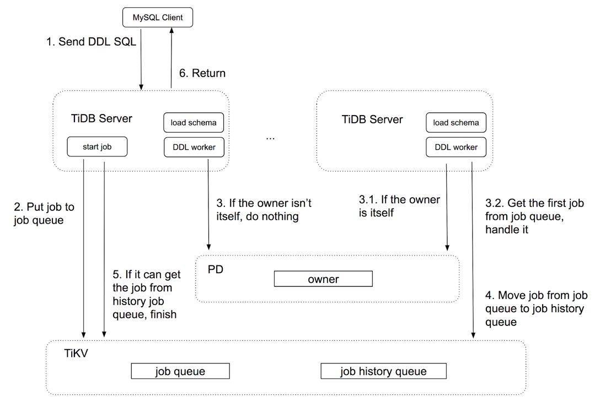
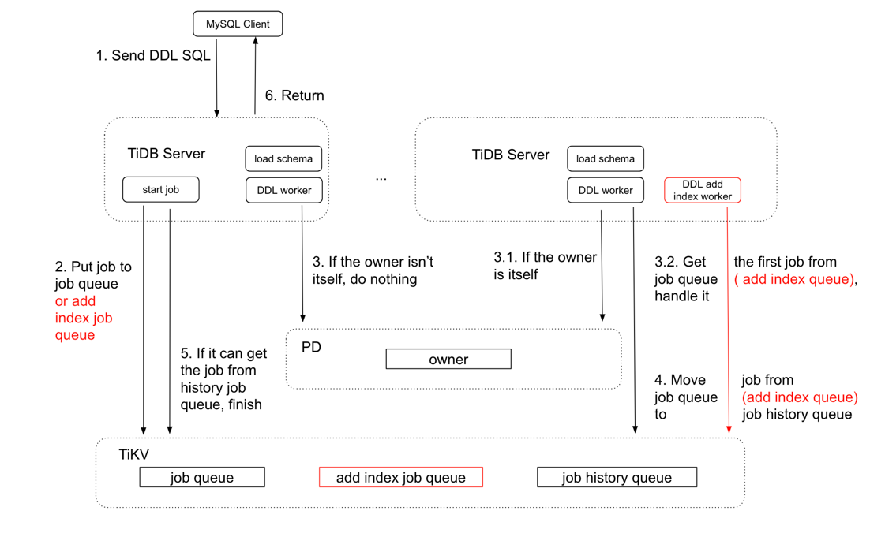

# TiDB Source Code Reading Series Article: DDL Implementation

This article will first introduce the overall design of the TiDB DDL component and how to support unlocked schema changes in a distributed scene. We'll describe the general process of this algorithm, and then detail the source code of some common DDL statements.

## DDL in TiDB

TiDB's DDL completes unlocked, online schema changes in a distributed environment by implementing Google F1's online asynchronous schema change algorithm. To simplify the design, TiDB allows DDL operations at only one node at a time. Users can send multiple DDL requests to any TiDB node, but all DDL requests are executed in series inside the TiDB **owner** node's **worker**.

* worker: Each node has a worker to handle DDL operations.
* owner: Only one node in the entire cluster can be elected owner, and each node may be elected to this role. The node worker after being elected owner has the right to handle DDL operations. Owner nodes are produced using Etcd's election function. Owner has a term of office, and the owner will actively maintain its term by renewing the contract. When owner nodes go down, other nodes can detect this through Etcd and elect a new owner.

The figure below describes a simple DDL request processing flow in TiDB:

*Figure 1: Processing process of DDL SQL in TiDB*

TiDB's DDL component related codes are stored in the source code directory `ddl`. Here are the key files:

| File | Introduction |
|------|--------------|
| `ddl.go` | Contains DDL interface definition and its implementation |
| `ddl_api.go` | Provides API for operations like create, drop, alter, truncate, rename, etc. for use by Executor. The main function is to encapsulate the DDL operation as a job and deposit it in the DDL job queue, waiting for execution results |
| `ddl_worker.go` | Implementation of DDL worker. The worker at the owner node takes jobs from the job queue, executes them, and deposits them into the job history queue after execution |
| `syncer.go` | Responsible for synchronization of `schema version` between ddl worker owner and follower. After each DDL state change, the `schema version ID` will increment by 1 |

The `ddl owner` related codes are placed separately under the `owner` directory, implementing functions such as owner elections.

Also, both the `ddl job queue` and `history ddl job queue` are persisted into TiKV. The `structure` directory contains implementations of data structures on TiKV like `hash` and others.

**This article follows the source code of TiDB [origin/source-code](https://github.com/pingcap/tidb/tree/source-code) branch. The latest master branch and source-code branch codes may differ slightly.**

## Create table

`create table` needs to analyze table meta-information ([TableInfo](https://github.com/pingcap/tidb/blob/source-code/model/model.go#L95)) from SQL, perform some checks, and then save the table meta-information to TiKV. The specific process is:

1. Grammar analysis: [ParseSQL](https://github.com/pingcap/tidb/blob/source-code/session.go#L790) parses into an abstract syntax tree [CreateTableStmt](https://github.com/pingcap/tidb/blob/source-code/ast/ddl.go#L393).

2. Compilation generates Plan: [Compile](https://github.com/pingcap/tidb/blob/source-code/session.go#L805) generates DDL plan and checks permissions.

3. Generate executor: [buildExecutor](https://github.com/pingcap/tidb/blob/source-code/executor/adapter.go#L227) generates [DDLExec](https://github.com/pingcap/tidb/blob/source-code/executor/ddl.go#L33) executor. TiDB's executor uses the volcano model.

4. Executor calls [e.Next](https://github.com/pingcap/tidb/blob/source-code/executor/adapter.go#L300) to start execution, i.e. the [DDLExec.Next](https://github.com/pingcap/tidb/blob/source-code/executor/ddl.go#L42) method, which determines DDL type and executes [executeCreateTable](https://github.com/pingcap/tidb/blob/source-code/executor/ddl.go#L68). This essentially calls the [CreateTable](https://github.com/pingcap/tidb/blob/source-code/ddl/ddl_api.go#L739) function in `ddl_api.go`.

5. The [CreateTable](https://github.com/pingcap/tidb/blob/source-code/ddl/ddl_api.go#L739) method's main process is:
   * First checks restrictions like whether table name exists, if name is too long, duplicate definitions etc.
   * [buildTableInfo](https://github.com/pingcap/tidb/blob/source-code/ddl/ddl_api.go#L775) gets global table ID, generates `tableInfo` (table meta-information), then encapsulates as a DDL job containing `table ID` and `tableInfo`, marking job type as `ActionCreateTable`.
   * [d.doDDLJob(ctx, job)](https://github.com/pingcap/tidb/blob/source-code/ddl/ddl_api.go#L793) function's [d.addDDLJob(ctx, job)](https://github.com/pingcap/tidb/blob/source-code/ddl/ddl.go#L423) will first get a global job ID and put it in job queue.
   * After DDL component activation, [start](https://github.com/pingcap/tidb/blob/source-code/ddl/ddl.go#L318) will activate a `ddl_worker` goroutine [onDDLWorker](https://github.com/pingcap/tidb/blob/source-code/ddl/ddl_worker.go#L37) function (renamed in latest master branch). This periodically calls [handleDDLJobQueue](https://github.com/pingcap/tidb/blob/source-code/ddl/ddl_worker.go#L193) to process jobs in the DDL queue. `ddl_worker` checks if it's owner - if not, returns; if yes, calls [getFirstDDLJob](https://github.com/pingcap/tidb/blob/source-code/ddl/ddl_worker.go#L212) to get first job and executes via [runDDLJob](https://github.com/pingcap/tidb/blob/source-code/ddl/ddl_worker.go#L236).
      * [runDDLJob](https://github.com/pingcap/tidb/blob/source-code/ddl/ddl_worker.go#L275) calls corresponding execution function based on job type. For `create table`, calls [onCreateTable](https://github.com/pingcap/tidb/blob/source-code/ddl/table.go#L31), does checks, then calls [t.CreateTable](https://github.com/pingcap/tidb/blob/source-code/ddl/table.go#L56) which maps `db_ID` and `table_ID` as `key`, saves `tableInfo` as value in TiKV and updates job status.
   * [finishDDLJob](https://github.com/pingcap/tidb/blob/source-code/ddl/ddl_worker.go#L152) removes job from DDL queue and adds to history queue.
   * [doDDLJob](https://github.com/pingcap/tidb/blob/source-code/ddl/ddl.go#L451) returns after detecting corresponding job in history queue.

## Add index

`add index` mainly does 2 things:

* Modify table meta-information by adding `indexInfo` to table meta-information
* For existing table data rows, backfill all `index columns` values into `index record`

The initial execution process (SQL parsing, Compile etc) is similar to `create table`. Starting from [DDLExec.Next](https://github.com/pingcap/tidb/blob/source-code/executor/ddl.go#L42), it calls the alter statement's [e.executeAlterTable(x)](https://github.com/pingcap/tidb/blob/source-code/executor/ddl.go#L78) function, which essentially calls DDL's [AlterTable](https://github.com/pingcap/tidb/blob/source-code/ddl/ddl_api.go#L862) function, then [CreateIndex](https://github.com/pingcap/tidb/blob/source-code/ddl/ddl_api.go#L1536). The specific process is:

1. Check restrictions like table existence, index existence, index name length etc.

2. Encapsulate as a job including index name, index columns etc, marking job type as `ActionAddIndex`.

3. Get global job ID and put in DDL job queue.

4. `owner ddl worker` takes job from queue and calls [onCreateIndex](https://github.com/pingcap/tidb/blob/source-code/ddl/index.go#L177) based on type.
   * `buildIndexInfo` generates `indexInfo` then updates `Indices` in `tableInfo`, persisting to TiKV.
   * Online schema change involves several steps, [note the indexInfo status changes](https://github.com/pingcap/tidb/blob/source-code/ddl/index.go#L237): `none -> delete only -> write only -> reorganization -> public`. During `reorganization -> public`, first calls [getReorgInfo](https://github.com/pingcap/tidb/blob/source-code/ddl/reorg.go#L147) to get `reorgInfo` containing range needing reorganization (first to last table row). Then calls [runReorgJob](https://github.com/pingcap/tidb/blob/source-code/ddl/reorg.go#L72), [addTableIndex](https://github.com/pingcap/tidb/blob/source-code/ddl/index.go#L554) to start backfilling data to `index record`. [runReorgJob](https://github.com/pingcap/tidb/blob/source-code/ddl/reorg.go#L112) periodically saves backfill progress to TiKV. [addTableIndex](https://github.com/pingcap/tidb/blob/source-code/ddl/index.go#L566) process:
      * Start multiple `workers` for backfilling data to `index record`
      * Split `reorgInfo` reorganization range into multiple ranges. Default scan range is `[startHandle, endHandle]`, split into ranges of 128 rows for parallel scanning. Master branch gets range info from PD.
      * Pack ranges into multiple tasks and send to `workers` for parallel backfilling
      * Wait for all `workers` to complete, update `reorg` progress, continue step 3 until all tasks finished

5. Follow-up implements [finishDDLJob](https://github.com/pingcap/tidb/blob/source-code/ddl/ddl_worker.go#L152), history DDL job process similar to `create table`.

## Drop Column

`drop Column` only modifies table meta-information by deleting the column from table meta-information. The original column data in table rows is not deleted - when decoding row data, it decodes based on table meta-information.

Initial process is similar, jumping to [DropColumn](https://github.com/pingcap/tidb/blob/source-code/ddl/ddl_api.go#L1093) function. Specific process:

1. Check if table exists, column to drop exists, etc.

2. Encapsulate as job, mark type as `ActionDropColumn` and put in DDL job queue

3. `owner ddl worker` takes job from queue and calls [onDropColumn](https://github.com/pingcap/tidb/blob/source-code/ddl/column.go#L174) based on type:
   * `column info` state changes opposite to `add index`: `public -> write only -> delete only -> reorganization -> absent`
   * [updateVersionAndTableInfo](https://github.com/pingcap/tidb/blob/source-code/ddl/table.go#L362) updates Columns in table meta-information

4. Follow-up implements [finishDDLJob](https://github.com/pingcap/tidb/blob/source-code/ddl/ddl_worker.go#L152), history DDL job process similar to `create table`.

## Drop table

`drop table` needs to delete both table meta-information and table data.

Initial process similar, `owner ddl worker` takes job from DDL queue and executes [onDropTable](https://github.com/pingcap/tidb/blob/source-code/ddl/table.go#L76) function:

1. `tableInfo` state changes: `public -> write only -> delete only -> none`

2. When `tableInfo` state becomes `none`, calls [DropTable](https://github.com/pingcap/tidb/blob/source-code/meta/meta.go#L306) to remove table meta-information from TiKV.

For deleting table data, after calling [finishDDLJob](https://github.com/pingcap/tidb/blob/source-code/ddl/ddl_worker.go#L152) to remove from job queue and before adding to history queue, calls [delRangeManager.addDelRangeJob(job)](https://github.com/pingcap/tidb/blob/source-code/ddl/ddl_worker.go#L160) to insert the table data range to delete into `gc_delete_range`. Then [GC worker](https://github.com/pingcap/tidb/blob/source-code/store/tikv/gcworker/gc_worker.go) performs actual data deletion during GC based on `gc_delete_range` information.

## New Parallel DDL

The latest TiDB master branch has introduced parallel DDLs to speed up multiple DDL statement execution. With serial DDL implementation, `add index` operations need to backfill existing table data to `index record`, which can block subsequent DDL operations if the table has lots of data. The current parallel DDL design puts `add index job` in a new `add index job queue`, while other DDL job types remain in the original queue. A dedicated `add index worker` handles the `add index job queue`.

*Figure 2: Parallel DDL processing process*

Parallel DDL introduces job dependencies. Job dependency means DDL jobs on the same table must execute in job ID order, since DDL operations on the same table must be sequential. For example, with `add column a` then `add index on column a`, if `add index` executes first while `add column` is still in queue, `add index on column a` will incorrectly report that column a can't be found. So before executing job2 from `add index job queue`, it must check if job queue has any unexecuted job1 on the same table by comparing job IDs. It also needs to check for unexecuted dependent jobs when processing jobs in the job queue.

## End

TiDB currently supports [more than ten DDL operations](https://github.com/pingcap/tidb/blob/source-code/model/ddl.go#L32). For specific MySQL compatibility details, see the [CREATE TABLE documentation](https://docs.pingcap.com/zh/tidb/stable/mysql-compatibility). Readers can explore other DDL types' source code on their own, as the process is similar to the DDLs covered above.

> Click to see more [TiDB source code reading series articles](https://cn.pingcap.com/blog/tag/tidb-source-code-reading/) 
