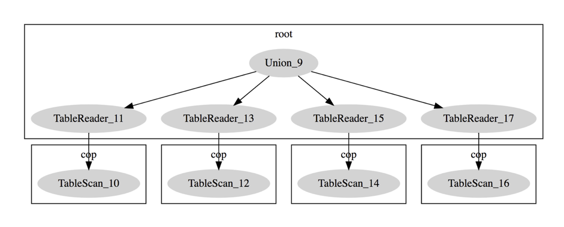

# TiDB Source Code Reading Series Article: Table Partition Implementation

This article mainly introduces the implementation of Table Partition in TiDB.

## Table Partition

### What is Table Partition

Table Partition refers to the decomposition of a table in the database into multiple smaller and easier to manage parts according to certain rules. Logically, there is only one table, but the bottom layer is composed of multiple physical partitions. Users familiar with related traditional databases should be familiar with this concept.

TiDB supports table partitioning. A partitioned table in TiDB is a single logical table, but the underlying layer consists of multiple physical subtables. Physical subtables are actually ordinary tables, and data is divided into different physical subtables according to certain rules. Users operate using the logical table name, and the TiDB server automatically handles data partitioning.

### Benefits of Table Partitioning

1. Query optimization using partition information. When partition conditions are included in the query, only one or more relevant partitions need to be scanned, improving query efficiency.

2. Easy data lifecycle management. By creating and deleting partitions, expired data can be efficiently archived. This is more elegant than using DELETE statements to remove data. Breaking down hotspots and distributing one table into multiple physical tables spreads out the load. For tables with sequential data (such as Auto Increment ID or creation time index), throughput can be significantly improved.

### Restrictions on Table Partitioning

1. TiDB defaults to a maximum of 1024 partitions per table. Partition names are case-insensitive.

2. Range, List, and Hash partitioning require that the partition key must be INT type, or return INT type through expressions. However, when using Key partitioning, other column types (except BLOB, TEXT) can be used as partition keys.

3. If there is a primary key or unique index column in the partition field, then both the primary key column and unique index column must be included.

4. TiDB's partitioning applies to all data and indexes of a table. It's not possible to partition only table data but not indexes, or only indexes but not table data.

### Common Types of Table Partitioning

* Range Partitioning: Divides partitions according to the range of partition expressions. Usually used to query the partition key by range. The partition expression can be a list or expression. For example, in an employees table, p0, p1, p2, p3 indicate Range ranges of (min, 1991), [1991, 1996), etc.

* List Partitioning: Divides according to values in a List, mainly used for enumerated types. The difference from Range partitioning is that Range partition interval values are continuous.

* Hash Partitioning: Hash partitioning requires specifying partition keys and partition numbers. The result of an INT type is calculated by the Hash partition expression, and this result is used with the partition size to determine which partition specific data belongs to. Usually used for point queries of given partition keys. Hash partitioning is mainly used to spread hotspots to ensure data is distributed as evenly as possible across predetermined partitions.

* Key Partitioning: Similar to Hash partitioning, but while Hash allows user-defined expressions, Key partitioning does not. Hash only supports integer partitions, while Key partitioning supports other column types besides BLOB and TEXT as partition keys.

## Implementation of TiDB Table Partition

This article follows the source code of TiDB [release-2.1](https://github.com/pingcap/tidb/tree/release-2.1) branch. Some explanations will reference the [source-code](https://github.com/pingcap/tidb/tree/source-code) branch. Currently only Range partitioning is supported, so we'll only introduce the source code implementation of Range type table partitioning, including five statements: create table, select, add partition, insert, and drop partition.

### create table

For create table, we'll focus on building the Partition part. For more details, see [TiDB Source Code Reading Series Article (17) DDL Source Code Analysis](https://pingcap.com/blog-cn/tidb-source-code-reading-17/). When a user executes the SQL statement to create a partitioned table, the Parser stage will convert the Partition information in the SQL statement into [ast.PartitionOptions](https://github.com/pingcap/tidb/blob/release-2.1/ast/ddl.go). Next, a series of checks are performed: whether partition names are unique within the current partitioned table, whether partition Range values remain increasing, if the partition key constitutes an expression checking whether the expression is allowed, and checking if the partition key is INT type or returns INT type through expressions, and whether the partition key meets certain constraints.

The partition key is the collection used to calculate which partition a row of data belongs to in the partitioned table. The composition of the partition key may be a field, multiple fields, or expressions.

The `PartitionOptions` structure's Tp field indicates the partition type, `Expr` field indicates the partition key, `ColumnNames` field indicates Columns partitioning. This type of partitioning includes Range columns partitioning and List columns partitioning, which won't be introduced here. In `PartitionDefinition`, the Name field indicates the partition name, `LessThan` means the Range value of the partition, `MaxValue` field indicates whether the Range value is the maximum value, and `Comment` field indicates the description of the partition.

The main processes of [CreateTable](https://github.com/pingcap/tidb/blob/release-2.1/ddl/ddl_api.go#L905) Partition are:

1. The Parser stage converts Partition information in SQL statements into `ast.PartitionOptions`, then [buildTablePartitionInfo](https://github.com/pingcap/tidb/blob/release-2.1/ddl/partition.go#L41) converts `PartitionOptions` structure to `PartitionInfo`, which is Partition's meta-information.

2. [checkPartitionNameUnique](https://github.com/pingcap/tidb/blob/release-2.1/ddl/partition.go#L88) checks whether partition names are repeated, ignoring case.

3. Check each partition's Range value. [checkAddPartitionValue](https://github.com/pingcap/tidb/blob/release-2.1/ddl/table.go#L469) verifies that new Partition Range values must be larger than all previous Partition Range values.

4. TiDB allows at most [1024 partitions](https://github.com/pingcap/tidb/blob/release-2.1/ddl/partition.go#L329) per table. Exceeding this limit will fail creation.

5. If the partition key composition is an expression with functions, [checkPartitionFuncValid](https://github.com/pingcap/tidb/blob/release-2.1/ddl/partition.go#L107) checks whether the expression is allowed.

6. [checkPartitionFuncType](https://github.com/pingcap/tidb/blob/release-2.1/ddl/partition.go#L149) checks that the partition key must be INT type or return INT type through expressions, and verifies fields in the partition key exist in the table.

7. If there is a primary key or unique index column in the partition field, then both the primary key column and unique index column must be included. That is, the partition field either contains no primary key or index columns, or contains all primary key and index columns [checkRangePartitioningKeysConstraints](https://github.com/pingcap/tidb/blob/release-2.1/ddl/partition.go#L348).

8. After passing all `PartitionInfo` checks, note that we don't store Partition metadata separately but attach it to [TableInfo](https://github.com/pingcap/tidb/blob/release-2.1/model/model.go#L142) Partition.

### add partition

add partition first needs to analyze Partition meta-information from SQL, then performs some checks and restrictions on the currently added partitions. The main checks are whether it's a partitioned table, if the partition name already exists, maximum partition limit, and whether Range values remain increasing. Finally, it adds Partition meta-information [PartitionInfo](https://github.com/pingcap/tidb/blob/release-2.1/model/model.go#L308) to Table [TableInfo](https://github.com/pingcap/tidb/blob/release-2.1/model/model.go#L142), as follows:

1. Check if it's a partitioned table, return error if not.

2. Parse user's SQL statement into [ast.PartitionDefinition](https://github.com/pingcap/tidb/blob/release-2.1/ast/ddl.go#L880), then [buildPartitionInfo](https://github.com/pingcap/tidb/blob/release-2.1/ddl/ddl_api.go#L2123) preserves existing partition information in the table (partition type, key, specific info) and assigns each new partition an independent PartitionID.

3. TiDB allows at most [1024 partitions](https://github.com/pingcap/tidb/blob/release-2.1/ddl/partition.go#L329) per table. Exceeding this limit returns error.

4. For each new partition, Range values need checking. [checkAddPartitionValue](https://github.com/pingcap/tidb/blob/release-2.1/ddl/table.go#L469) verifies new Partition Range values must be larger than all previous Partition Range values.

5. [checkPartitionNameUnique](https://github.com/pingcap/tidb/blob/release-2.1/ddl/partition.go#L88) checks whether partition names are repeated, ignoring case.

6. Finally add Partition meta-information [PartitionInfo](https://github.com/pingcap/tidb/blob/release-2.1/model/model.go#L308) to Table [TableInfo](https://github.com/pingcap/tidb/blob/release-2.1/model/model.go#L142) Partition. The specific implementation is in [updatePartitionInfo](https://github.com/pingcap/tidb/blob/release-2.1/ddl/table.go#L459).

### drop partition

drop partition is similar to drop table, but first needs to find the corresponding Partition ID, then delete the corresponding data and modify the Partition meta-information in Table. The difference is that drop table deletes the entire table data and [TableInfo](https://github.com/pingcap/tidb/blob/release-2.1/model/model.go#L142) meta-information, while drop partition only deletes the corresponding partition data and Partition meta-information in [TableInfo](https://github.com/pingcap/tidb/blob/release-2.1/model/model.go#L142). Before deleting a partition:

1. Can only perform [drop partition operation](https://github.com/pingcap/tidb/blob/release-2.1/ddl/ddl_api.go#L1355) on partitioned tables. Returns error if not a partitioned table.

2. [checkDropTablePartition](https://github.com/pingcap/tidb/blob/release-2.1/ddl/partition.go#L269) checks if the partition to delete exists. TiDB doesn't allow deleting all partitions - use drop table instead to delete the last partition.

3. [removePartitionInfo](https://github.com/pingcap/tidb/blob/release-2.1/ddl/partition.go#L283) will delete the partition meta-information after [checkDropTablePartition](https://github.com/pingcap/tidb/blob/release-2.1/ddl/partition.go#L269) check.

4. For partition data, need to get PartitionID to construct StartKey and EndKey according to encoding rules when inserting data. This can contain all data in the corresponding partition Range for deletion. See [specific code](https://github.com/pingcap/tidb/blob/release-2.1/ddl/delete_range.go#L250).

5. Encoding rules:
   Key: `tablePrefix_rowPrefix_partitionID_rowID`
   startKey: `tablePrefix_rowPrefix_partitionID`
   endKey: `tablePrefix_rowPrefix_partitionID + 1`

6. When a partition is deleted, all data in that partition is also deleted. If deleting a partition means remaining partitions can't cover all values, inserting data will return error.

### Select statement

Select statements focus on how Select Partition queries and Partition Pruning work. See [TiDB source code reading series article (6) Select statement overview](https://cn.pingcap.com/blog/tidb-source-code-reading-6/) for more details.

The processing of a SQL statement involves receiving data from Client, MySQL protocol analysis and conversion, SQL grammar analysis, logical query plan and physical query plan execution, to final result return. For querying data in partitioned tables, the main modification is in the [Logical query plan](https://github.com/pingcap/tidb/blob/release-2.1/planner/core/rule_partition_processor.go#L39) stage. For example, using the employee table above, there's no difference in the first few stages of SQL statement processing, but in logical query planning, [rewriteDataSource](https://github.com/pingcap/tidb/blob/release-2.1/planner/core/rule_partition_processor.go#L46) rewrites DataSource into Union All. Each Partition id corresponds to a Table Reader.

By observing `EXPLAIN` results we can confirm the above examples. As shown in Figure 1, there are four Table Readers in the final physical execution plan because there are four partitions in the employee table. `Table Reader` means reading from TiKV end at TiDB end, `cop task` refers to calculation tasks pushed down to TiKV end for distributed execution.

Figure 1: EXPLAIN output

When users use partitioned tables, they often only need to access some partitions, just like the locality principle of programs. The optimizer analyzes `FROM` and `WHERE` clauses to eliminate unnecessary partitions, specifically optimizing to avoid accessing unrelated partitions based on conditions in actual SQL statements. We call this Partition Pruning. [here](https://github.com/pingcap/tidb/blob/release-2.1/planner/core/rule_partition_processor.go#L70). Partition pruning is an important optimization method provided by partitioned tables. Through partition pruning, avoiding access to unrelated data can speed up queries. Of course, users can deliberately use partition pruning characteristics to add conditions in SQL to optimize query performance.

### Insert

[Insert](https://cn.pingcap.com/blog/tidb-source-code-reading-4/) - how is data written in Table Partition?

These questions need to be explained:

1. How to distinguish between ordinary tables and partitioned tables?
2. Which Partition should data be inserted into?
3. What's the difference between each Partition's RowKey encoding and ordinary tables?
4. How to insert data into the corresponding Partition?

Ordinary Table and Table Partition both implement the Table interface. When loading schema and initializing Table data structure, if `tableInfo` has no Partition information, it generates an ordinary `tables.Table`. Ordinary Table keeps the same processing logic as before. If `tableInfo` has Partition information, it generates a `tables.PartitionedTable`. The difference between them is the encoding method of RowKey.

## End

TiDB currently supports Range partition types, click to view [specific details](https://github.com/pingcap/tidb/tree/source-code). The remaining partition types are under development and will be available in future updates. Their source code implementation will be similar to what's described above. Stay tuned!

> Click to see more [TiDB source code reading series articles](https://cn.pingcap.com/blog/tag/tidb-source-code-reading/) 
