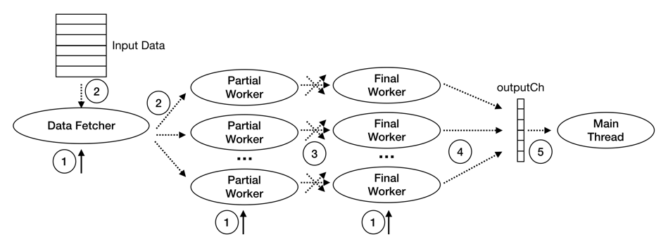
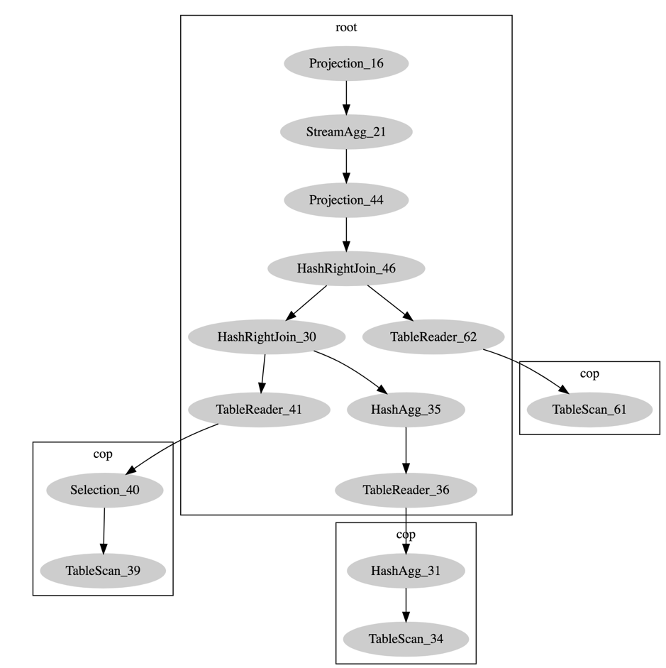
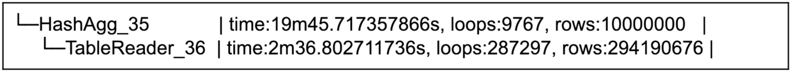
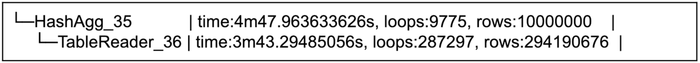

# TiDB Source Code Reading Series Article: Hash Aggregation Implementation

This article introduces the principles and implementation details of Hash Aggregation in TiDB.

## Principles of Aggregation Algorithm Implementation

In SQL, aggregation operations perform calculations on a set of values and return a single value. TiDB implements 2 kinds of aggregation algorithms: Hash Aggregation and Stream Aggregation.

Let's first take the `AVG` function as an example (case reference [Stack Overflow](https://stackoverflow.com/questions/1471147/how-do-aggregates-group-by-work-on-sql-server/1471167#1471167)) to briefly describe the implementation principles of these two algorithms.

Suppose table `t` is as follows:

| a | b  |
|---|-----|
| 1 | 9   |
| 1 | -8  |
| 2 | -7  |
| 2 | 6   |
| 1 | 5   |
| 2 | 4   |

SQL: `select avg(b) from t group by a` requests to group table `t` data according to `a` values and calculate the average of `b` values for each group. Whether using Hash or Stream aggregation, when calculating the `AVG` function, we need to maintain 2 intermediate result variables: `sum` and `count`. The implementation principles of Hash and Stream aggregation algorithms are as follows.

### Hash Aggregate Execution Principle

In the calculation process of Hash Aggregate, we need to maintain a Hash table where the key is the `Group-By` column and the value contains the intermediate results of the aggregation function (`sum` and `count`). In this case, the key is column `a` value, and the value contains `sum(b)` and `count(b)`.

During calculation, we only need to calculate the key based on each row's input data and find the corresponding value in the Hash table to update. The execution process for this case is simulated as follows:

| Input data `a` `b` | Hash table `[key] (sum, count)` |
|-------------------|--------------------------------|
| 1 9               | [1] (9, 1)                     |
| 1 -8              | [1] (1, 2)                     |
| 2 -7              | [1] (1, 2) [2] (-7, 1)        |
| 2 6               | [1] (1, 2) [2] (-1, 2)        |
| 1 5               | [1] (6, 3) [2] (-1, 2)        |
| 2 4               | [1] (6, 3) [2] (3, 3)         |

After processing all input data, scanning the Hash table and calculating gives us the final result:

| Hash table        | `avg(b)` |
|-------------------|----------|
| [1] (6, 3)       | 2        |
| [2] (3, 3)       | 1        |

### Stream Aggregation Implementation Principle

Stream Aggregate's calculations require input data to be **ordered by the `Group-By` columns**. During calculation, whenever a new group's value is read or all input data is processed, the final aggregation result of the previous group is calculated.

For this example, we first sort the input data by `a`. After sorting, the execution process is simulated as follows:

| Input data | New group or all data processed? | (sum, count) | `avg(b)` |
|------------|----------------------------------|--------------|----------|
| 1 9        | Yes                              | (9, 1)      | Previous group empty, no calculation |
| 1 -8       | No                               | (1, 2)      |          |
| 1 5        | No                               | (6, 3)      |          |
| 2 -7       | Yes                              | (-7, 1)     | 2        |
| 2 6        | No                               | (-1, 2)     |          |
| 2 4        | No                               | (3, 3)      |          |
|            | Yes                              |             | 1        |

Because Stream Aggregate requires input data to be ordered so that data from the same group enters continuously, it can return results immediately after processing each group's data. Unlike Hash Aggregate, it doesn't need to process all data before returning correct results. When the parent operator only needs part of the results (e.g., with LIMIT), Stream Aggregate can stop unnecessary calculations early once it has the required number of rows.

When there is an index on the `Group-By` columns, the data read through the index naturally ensures the input data is ordered by `Group-By` columns. In this case, data from the same group enters Stream Aggregate calculations continuously, avoiding additional sorting operations.

## TiDB Aggregation Function Calculation Modes

Due to distributed computing requirements, TiDB divides the calculation stages of aggregation functions and defines five calculation modes accordingly: CompleteMode, FinalMode, Partial1Mode, Partial2Mode, and DedupMode. Different calculation modes process different input and output values, as shown in the following table:

| AggFunctionMode | Input value | Output value |
|----------------|-------------|--------------|
| CompleteMode   | Original data | Final result |
| FinalMode      | Intermediate result | Final result |
| Partial1Mode   | Original data | Intermediate result |
| Partial2Mode   | Intermediate result | Further aggregated intermediate result |
| DedupMode      | Original data | Deduplicated original data |

For the example `select avg(b) from t group by a` mentioned above, by dividing the calculation stages, there can be many different combinations of calculation modes, such as:

1. Push aggregation down to TiKV for calculation (Partial1Mode) and return pre-aggregated intermediate results. To fully utilize the CPU and memory resources of the TiDB server machine and accelerate aggregation calculations at the TiDB layer, the aggregation function calculation at the TiDB layer can be done as: Partial2Mode -> FinalMode.

2. When the aggregation function needs to deduplicate parameters (has `DISTINCT` attribute) and when the aggregation cannot be pushed to TiKV for some reason, the calculation at the TiDB layer can be done as: DedupMode -> Partial1Mode -> FinalMode.

The aggregation function's execution stages, the corresponding mode in each stage, whether to push down to TiKV, whether to use Hash or Stream aggregation, etc., are all determined by the optimizer based on data distribution and estimated calculation cost.

## TiDB's Hash Aggregation Implementation

### Building the Hash Aggregation Executor

1. When [building the logical execution plan](https://github.com/pingcap/tidb/blob/v2.1.0/planner/core/logical_plan_builder.go#L95), call [NewAggFuncDesc](https://github.com/pingcap/tidb/blob/v2.1.0/expression/aggregation/descriptor.go#L49) to encapsulate the aggregation function's metadata as an [AggFuncDesc](https://github.com/pingcap/tidb/blob/v2.1.0/expression/aggregation/descriptor.go#L35-L46). `AggFuncDesc.RetTp` is derived by [AggFuncDesc.typeInfer](https://github.com/pingcap/tidb/tree/v2.1.0/expression/aggregation/descriptor.go#L146-L163) based on the aggregation function type and parameter type; `AggFuncDesc.Mode` is initially set to CompleteMode.

2. During [physical execution plan construction](https://github.com/pingcap/tidb/tree/v2.1.0/planner/core/task.go#L487), `PhysicalHashAgg` and `PhysicalStreamAgg`'s `attach2Task` method will try to push down aggregation calculations based on the current `task`. If the `task` type meets basic requirements for pushdown (e.g., `copTask`), it will call [newPartialAggregate](https://github.com/pingcap/tidb/tree/v2.1.0/planner/core/task.go#L380) to try decomposing the aggregation into Partial calculation on TiKV and Final calculation executed by TiDB. The [AggFuncToPBExpr](https://github.com/pingcap/tidb/tree/v2.1.0/expression/aggregation/agg_to_pb.go#L25) function determines whether an aggregation function can be pushed down.

3. During [HashAgg executor construction](https://github.com/pingcap/tidb/blob/v2.1.0/executor/builder.go#L999), first check if the current `HashAgg` operator [can execute in parallel](https://github.com/pingcap/tidb/blob/v2.1.0/executor/builder.go#L1037-L1047).

### Parallel Hash Aggregation Implementation Details

TiDB's parallel Hash Aggregation calculation involves these main threads: Main Thread, Data Fetcher, Partial Workers, and Final Workers:

* Main Thread (one):
  - Starts Input Reader, Partial Workers and Final Workers
  - Waits for Final Worker execution results and returns them

* Data Fetcher (one):
  - Reads child node data by batch and distributes it to Partial Workers 

* Partial Workers:
  - Read data sent by Data Fetcher and perform pre-aggregation
  - Shuffle pre-aggregation results to corresponding Final Workers based on group values

* Final Workers:
  - Read data sent by Partial Workers, calculate final results, and send to Main Thread

## Implementation Process Details

The implementation phase of Hash Aggregation can be divided into 5 steps as shown in the figure below:

1. Start Data Fetcher, Partial Workers, and Final Workers.
   This work is completed by the [`prepare4Parallel`](https://github.com/pingcap/tidb/tree/v2.1.0/executor/aggregate.go#L579) function. The function will start a Data Fetcher, [multiple Partial Workers](https://github.com/pingcap/tidb/tree/v2.1.0/executor/aggregate.go#L589-L591) and [multiple Final Workers](https://github.com/pingcap/tidb/tree/v2.1.0/executor/aggregate.go#L596-L598). The numbers of Partial Worker and Final Worker can be controlled separately through the `tidb_hashgg_partial_concurrency` and `tidb_hashagg_final_concurrency` system variables, with both defaulting to 4.

2. Data Fetcher reads child node data and distributes to Partial Workers.
   This work is completed by the [`fetchChildData`](https://github.com/pingcap/tidb/tree/v2.1.0/executor/aggregate.go#L535) function.

3. Partial Workers perform pre-aggregation calculations and shuffle to corresponding Final Workers based on Group Key.
   This work is completed by the [`HashAggPartialWorker.run`](https://github.com/pingcap/tidb/tree/v2.1.0/executor/aggregate.go#L326) function. The function calls [`updatePartialResult`](https://github.com/pingcap/tidb/tree/v2.1.0/executor/aggregate.go#L351) to execute [pre-aggregation calculations](https://github.com/pingcap/tidb/tree/v2.1.0/executor/aggregate.go#L358-L363) on data sent by Data Fetcher and stores pre-aggregation results in [`partialResultMap`](https://github.com/pingcap/tidb/tree/v2.1.0/executor/aggregate.go#L63). The `partialResultMap` is based on `Group-By` column values, with values being [`PartialResult`](https://github.com/pingcap/tidb/tree/v2.1.0/executor/aggfuncs/aggfuncs.go#L89) type groups. Each element in the group indicates the pre-aggregation result of the aggregation function corresponding to that group. The [`shuffleIntermData`](https://github.com/pingcap/tidb/tree/v2.1.0/executor/aggregate.go#L370) function completes shuffling to corresponding Final Workers based on group values.

4. Final Worker calculates final results and sends to Main Thread.
   This work is completed by the [`HashAggFinalWorker.run`](https://github.com/pingcap/tidb/tree/v2.1.0/executor/aggregate.go#L505) function. The function calls [`consumeIntermData`](https://github.com/pingcap/tidb/tree/v2.1.0/executor/aggregate.go#L434) to [receive aggregation results sent by Partial Workers](https://github.com/pingcap/tidb/tree/v2.1.0/executor/aggregate.go#L442), then [`merge`](https://github.com/pingcap/tidb/tree/v2.1.0/executor/aggregate.go#L459) to get the final result. The [`getFinalResult`](https://github.com/pingcap/tidb/tree/v2.1.0/executor/aggregate.go#L459) function completes sending the final result to Main Thread.

5. Main Thread receives final results and returns.

## TiDB Parallel Hash Aggregation Performance Improvement

Using [TPC-H query-17](https://github.com/pingcap/tidb-bench/blob/master/tpch/queries/17.sql) as an example, we can test the performance improvement of parallel Hash Aggregation compared to single-threaded calculation. Before introducing parallel Hash Aggregation, its calculation bottleneck was `HashAgg_35`.

The query execution plan is as follows:

In TiDB, you can use [EXPLAIN ANALYZE](https://docs.pingcap.com/zh/tidb/stable/explain-overview) to obtain SQL execution statistics. Due to space limitations, only the EXPLAIN ANALYZE results of part of the TPC-H query-17 calculations are shown.

When `HashAgg` calculates single-threaded:

Total query execution time was 23 minutes 24 seconds, with `HashAgg` execution time about 17 minutes 9 seconds.

When `HashAgg` calculates in parallel (with TiDB level Partial and Final stage worker counts set to 16):

Total query time was 8 minutes 37 seconds, with `HashAgg` execution time about 1 minute 4 seconds.

During parallel calculations, Hash Aggregation's calculation speed increased by about 16 times.

> See more [TiDB source code reading series articles](https://cn.pingcap.com/blog/tag/tidb-source-code-reading/)
