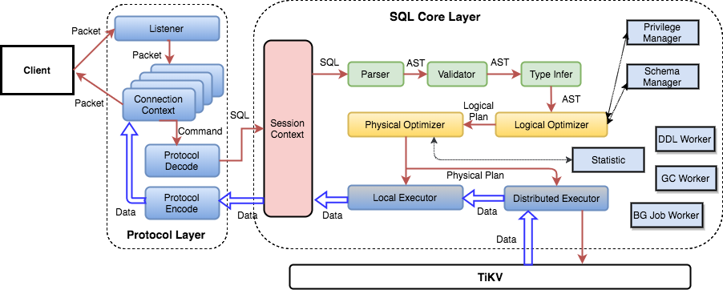

# TiDB Source Code Reading Series Part 2: Code Organization and Architecture

This article is the second in a series of TiDB source code reading articles. [The first article](https://cn.pingcap.com/blog/tidb-source-code-reading-1) introduced the overall architecture of TiDB, covering what modules TiDB has, what they do, where to start reading the code, what can be skipped, and what needs careful attention.

This article provides an introductory overview with relatively low difficulty. While some content may be familiar to readers from other sources, we include it here for completeness.

## TiDB Architecture

Starting with this simple architecture diagram that many have seen, we can describe TiDB in one sentence: "TiDB is a distributed SQL engine that supports the MySQL protocol and uses a transactional KV storage engine." From this description, we can identify three key aspects:

1. How to support the MySQL protocol and interact with clients
2. How to work with the underlying storage engine and access data  
3. How to implement SQL functionality

This article will first introduce TiDB's modules and functions, then use these three aspects as a guide to connect the modules.

## Code Introduction

TiDB's source code is fully hosted on GitHub at the [project homepage](https://github.com/pingcap/tidb). The project is developed in Go and divided into many packages based on functionality. Using dependency analysis tools, you can see the relationships between the internal packages.

Most packages provide services externally through interfaces, with most functionality concentrated in specific packages. However, some packages provide very basic functions and are depended on by many other packages. These packages require special attention.

The main entry point is in `tidb-server/main.go`, which defines how the service starts. The build method can be found in the [Makefile](https://github.com/pingcap/tidb/blob/source-code/Makefile#L140).

In addition to the code, there are many test examples in xx_test.go files. The `cmd` directory also contains several toolkits for performance testing and generating test data.

## Module Introduction

TiDB has many modules. Here is a comprehensive overview of what each module is used for. If you want to see code for specific functionality, you can directly find the corresponding module.

### Core Packages

| Package | Description |
|---------|-------------|
| ast | Defines abstract syntax tree data structures, e.g. `SelectStmt` defines the data structure for SELECT statements |
| config | Configuration file related logic |
| ddl | DDL execution logic |
| executor | Query execution logic - most statement execution happens here |
| expression | Expression-related logic including operators and built-in functions |
| parser | Grammar parsing module including lexer (lexer.go) and parser (parser.y) |
| plan | Query optimization related logic |
| server | MySQL protocol and session management logic |
| store/tikv | TiKV Go language client |
| types | Type-related logic including type definitions and operations |

### Supporting Packages

| Package | Description |
|---------|-------------|
| context | Core interfaces and abstractions used by many packages |
| distsql | Distributed computing interface abstraction |
| domain | Storage space abstraction for databases and tables |
| infoschema | SQL metadata management |
| kv | KV engine interfaces and common methods |
| meta | SQL metadata storage management |
| metrics | Metrics information |
| privilege | User privilege management |
| statistics | Statistical information module |
| structure | Transactional KV API structures like List/Queue/HashMap |
| tablecodec | SQL to Key-Value encoding |
| util | Various utility functions |

### Tool Packages

| Package | Description |
|---------|-------------|
| cmd/benchdb | Simple benchmark tool |
| cmd/benchkv | Transactional KV API benchmark tool |
| cmd/importer | Test data generation tool |
| cmd/benchfilesort | Performance optimization benchmark |
| cmd/benchraw | Raw KV API benchmark tool |

## Where to Start

With around 80 packages, TiDB's codebase can seem overwhelming at first. However, not all packages are equally important. Some packages are core to functionality while others are auxiliary. Where to start reading depends on your goals.

If you want to understand specific functionality details, refer to the module introductions above to find the relevant module.

If you want a comprehensive understanding, start with `tidb-server/main.go` to see how TiDB starts up, handles user requests, and executes SQL statements. Follow the code path to understand the execution process. Focus on important modules first and review auxiliary modules selectively.

## Important Modules

Of the 80 modules, these are the most important ones to read carefully:

- plan
- expression  
- executor
- distsql
- store/tikv
- ddl
- tablecodec
- server
- types
- kv
- tidb

## SQL Layer Architecture

This diagram provides more detail than the previous architecture overview. Follow the arrows from left to right to understand the flow.

### Protocol Layer

The leftmost part shows TiDB's Protocol Layer which interfaces with clients. Currently TiDB only supports the MySQL protocol, implemented in the `server` package.

This layer manages client connections, parses MySQL commands and returns results. The implementation follows the [MySQL protocol documentation](https://dev.mysql.com/doc/internals/en/client-server-protocol.html). This module is considered one of the best MySQL protocol implementations available.

### SQL Layer

A SQL statement generally goes through these stages:

1. Parsing
2. Validation  
3. Query planning
4. Plan optimization
5. Query generation
6. Execution and result return

This corresponds to the following TiDB packages:

| Package | Function |
|---------|----------|
| tidb | Protocol layer and SQL layer interface |
| parser | Grammar parsing |
| plan | Validation + Query planning + Plan optimization |
| executor | Executor generation and execution |
| distsql | Send to TiKV via client and aggregate results |
| store/tikv | TiKV Client |

### KV API Layer

TiDB relies on a storage engine for data access but is not tied to any specific engine (like TiKV). The storage engine must meet certain requirements:

1. Basic requirement: Transactional Key-Value engine with Go language driver
2. Advanced requirement: Support distributed computing interface

These requirements are defined in the `kv` package [interfaces](https://github.com/pingcap/tidb/blob/source-code/kv/kv.go). Storage engines must provide a Go driver implementing these interfaces.

## Summary

This overview has covered TiDB's source code structure and the three main architectural components. More detailed content will be covered in subsequent articles in the series.

> [View more TiDB source code reading series articles](https://cn.pingcap.com/blog/tag/tidb-source-code-reading/) 
