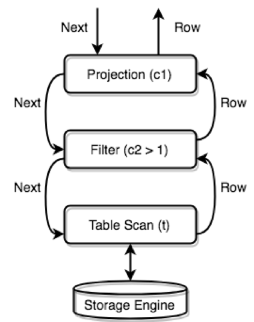
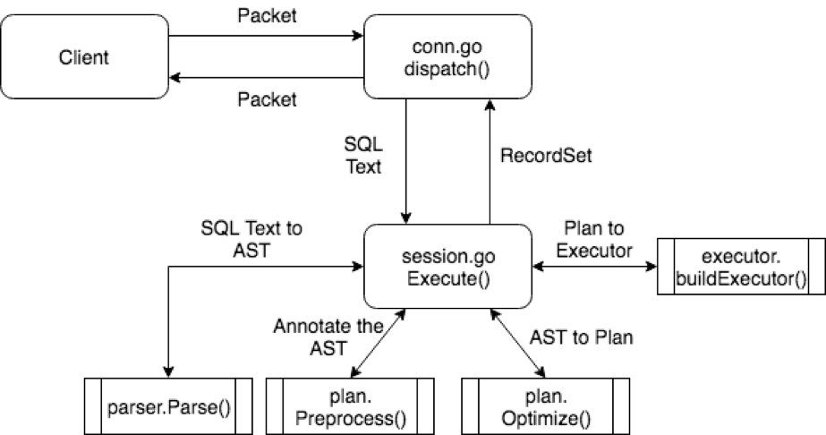

# TiDB Source Code Reading Series Part 3: SQL Processing Flow

This article is the third in the TiDB source code reading series. It introduces the SQL processing flow, explaining where the entry point is, what operations are needed for SQL processing, and how a SQL query flows through the system from input to output.

## Overview

The previous article explained the structure of the TiDB project and its three core components. This article starts with the SQL processing flow, introducing the entry points, required operations, and tracing a SQL query's path from input through processing to output.

While there are many types of SQL statements (read, write, modify, delete, management), each with its own execution logic, they generally follow a similar process and operate under a unified framework.

## Framework

Let's examine the overall workflow that a statement goes through. Recalling the three core parts mentioned in the previous article, we can think of it as:

1. First going through protocol analysis and conversion
2. Then through the SQL core layer's logical processing to generate a query plan
3. Finally accessing the storage engine to obtain data, calculate and return results

This is a rough processing framework that we'll refine in this article.

### Protocol Layer Entry

For the first part (protocol analysis and conversion), all logic is in the `server` package. The main logic is divided into two pieces:

1. Connection establishment and management, where each connection corresponds to a Session
2. Processing logic on a single connection

We'll focus on the second point - operations on an established connection. Connection establishment details (handshaking, setup, teardown) will be covered in future articles.

### SQL Layer Complexity

The SQL layer is the most complex part of TiDB for three reasons:

1. SQL language itself is complex with many statement types, data types, operators and grammar combinations. These "many" elements combine into "very many" possibilities requiring extensive code to handle.

2. SQL is a declarative language that specifies "what data is wanted" but not "how to get the data". Complex logic is needed to choose "how to get the data" - in other words, selecting a good query plan.

3. The underlying distributed storage engine presents challenges not found in single-machine storage engines. For example:
   - Query planning must consider that data is sharded
   - Network partition handling
   - Complex logic needed to handle these cases and encapsulate the handling mechanisms

These complexities can make understanding the source code challenging. This article will try to minimize these distractions and explain the core logic.

### Core Concepts

There are several core concepts that form the framework of this layer. Pay attention to these interfaces:

- Protocol parsing and conversion
- Query plan generation and optimization  
- Executor generation and execution
- Result set handling

### Protocol Layer Exit

The exit point is relatively simple - the `writeResultset` method writes results back to the client according to MySQL protocol requirements, including field lists and row data. Refer to the MySQL protocol documentation on [COM_QUERY Response](https://dev.mysql.com/doc/internals/en/com-query-response.html) for details.

## Session

The most important function in Session is `Execute`, which calls various modules described below to complete statement execution. Note that execution considers Session environment variables like `AutoCommit` and timezone settings.

## Lexer & Parser

These two components together form the Parser module. The Parser converts text into structured data (Abstract Syntax Tree or AST):

For example, the statement `SELECT * FROM t WHERE c > 1;` matches the `SelectStmt` rule and gets converted into a data structure with:

- `FROM t` parsed into the `FROM` field
- `WHERE c > 1` parsed into the `Where` field  
- `*` parsed into the `Fields` field

All statements are abstracted as an `ast.StmtNode` interface. Most AST package data structures implement the `ast.Node` interface which has an `Accept` method. Subsequent AST processing mainly relies on this Accept method, using the Visitor pattern to traverse nodes and transform the AST structure.

## Query Plan Generation and Optimization

After getting the AST, various validation, transformation and optimization steps occur. The entry point has three important steps:

1. `plan.Preprocess`: Performs validity checks and name binding
2. `plan.Optimize`: Creates and optimizes the query plan - one of the most core steps
3. Constructs `executor.ExecStmt`: This structure holds the query plan and is crucial for subsequent execution

## Executor Generation

In this process, the plan is converted into executors. The execution engine can then execute the previously determined query plan through these executors.

The executors are wrapped in a `recordSet` structure that implements the `ast.RecordSet` interface. This interface represents the abstraction of a query result set with methods to:

- Get column types via `Fields()`
- Get data rows via `Next()/NextChunk()`  
- Close the result set via `Close()`

## Running Executors

TiDB's execution engine runs on the Volcano model - all physical Executors form a tree structure where each layer gets results by calling `Next/NextChunk()` on the layer below.

For example, for the statement `SELECT c1 FROM t WHERE c2 > 1;` with a full table scan + filter plan, the executor tree would look like:

The diagram shows the call relationships between Executors and data flow. The top-level Next() call - the starting point of computation - happens in two places depending on statement type:

1. For SELECT statements that return results to the client, execution is driven where data is returned
2. For statements like INSERT that don't return data, execution is driven in the `recordSet` structure

## Summary

The execution framework of the SQL layer is described above. Here's a diagram of the entire process:

Through this article, you should now understand TiDB's SQL statement execution framework. While the overall logic is relatively simple, subsequent chapters will explain specific modules in the framework in detail. The next article will use specific examples to help reinforce understanding of this framework.

> See more [TiDB source code reading series articles](https://cn.pingcap.com/blog/tag/tidb-source-code-reading/) 
