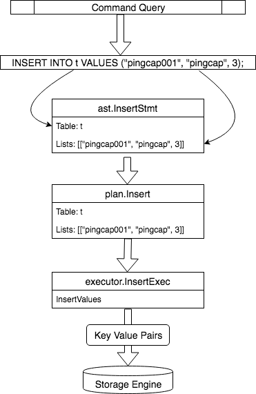

# TiDB Source Code Reading Series Part 4: Insert Statement Execution

This article is the fourth in the TiDB source code reading series. [The previous article](https://cn.pingcap.com/blog/tidb-source-code-reading-3) introduced the overall execution process. Regardless of the statement type, it generally runs under this framework, and DDL statements are no exception.

This article will use Insert statements as an example to help readers understand the previous article, and the next article will introduce the execution process of Select statements. These are the two most commonly used types of statements. For now, we'll only explain the core process for these two types. More complex operations like Join and Insert-Into-OnDuplicate-Update will be covered in subsequent articles. Additionally, this article will focus on the specific execution logic of each statement under the execution framework. Readers should understand the behavior of Insert statements before reading.

## Table Structure

Here is a table structure. The SQL statements described below all operate on this table.

## Insert

`INSERT INTO t VALUES ("pingcap001", "pingcap", 3);`

Let's use this statement as an example to explain how Insert works.

## Statement Processing

First, recall the framework introduced in the previous article. After processing through several modules such as the protocol layer, Parser, Plan, and Executor, a SQL statement becomes an executable structure, and then uses Next() to drive the actual execution of the statement. While the framework is similar for each type of statement, each statement has its own processing logic for each core step.

### Grammar Analysis

First, let's look at [Insert's parsing logic](https://github.com/pingcap/tidb/blob/source-code/parser/parser.y#L2525). You can see that this statement will be analyzed into [this structure](https://github.com/pingcap/tidb/blob/source-code/ast/dml.go#L706).

The statements mentioned here are relatively simple and only involve the Table and Lists fields - which table to insert into and what data to insert. Lists is a two-dimensional group, where each line corresponds to one row of data. This statement contains only one row of data. With the AST, a series of treatments are required, but we'll temporarily skip preprocessing, legality verification, and permissions checks (as the processing logic is similar for each statement). Let's look at the processing logic specific to Insert statements.

### Query Plan

Next is converting AST into a Plan structure. This operation is completed in [planBuilder.buildInsert()](https://github.com/pingcap/tidb/blob/source-code/plan/planbuilder.go#L752). For this simple statement, it mainly involves two parts:

1. Complete Schema information
   - Including Database/Table/Column information. Since this statement doesn't specify which columns to insert data into, it will use all columns.

2. Process data in Lists
   - [Here](https://github.com/pingcap/tidb/blob/source-code/plan/planbuilder.go#L821) it processes all Values, converting ast.ExprNode to expression.Expression, bringing them into our expression framework for later evaluation. In most cases, these Values are constants, i.e., expression.Constant.

For more complex Insert statements, like inserting data from a Select or handling OnDuplicateUpdate cases, additional processing would be done. We won't delve deeper into those cases here, but readers can look at the other code in buildInsert().

Now the ast.InsertStmt has been converted into a [plan.Insert](https://github.com/pingcap/tidb/blob/source-code/plan/common_plans.go#L265) structure. For Insert statements, there isn't much to optimize. The plan.Insert structure only implements the `Plan` interface, so it won't enter the Optimize flow in [this check](https://github.com/pingcap/tidb/blob/source-code/plan/optimizer.go#L81).

Other simple statements also won't enter doOptimize, like Show statements. The next article will cover Select statements, which will involve the doOptimize function.

### Execution

After getting the plan.Insert structure, the query plan is considered complete. Let's look at how Insert is executed.

First, plan.Insert is converted to executor.InsertExec structure [here](https://github.com/pingcap/tidb/blob/source-code/executor/builder.go#L338), and all subsequent execution is handled by this structure. The execution entry point is the [Next method](https://github.com/pingcap/tidb/blob/source-code/executor/write.go#L1084). The first step is to evaluate expressions for each row of data to be inserted, which you can see in the [getRows](https://github.com/pingcap/tidb/blob/source-code/executor/write.go#L1259) function. After getting the data, we enter the most important logic - the [InsertExec.exec()](https://github.com/pingcap/tidb/blob/source-code/executor/write.go#L880) function. While this function is quite long, considering only the SQL statement we're discussing, the logic can be simplified.

Let's look at how the [AddRecord](https://github.com/pingcap/tidb/blob/source-code/table/tables/tables.go#L345) function writes a row of data into the storage engine. To understand this code, you need to know how TiDB maps SQL data to Key-Value. You can read some of our previous articles, like [Three Articles to Understand TiDB Technical Insider - Computing](https://cn.pingcap.com/blog/tidb-internal-2). Assuming readers understand this background knowledge, you'll know that Row and Index Key-Values need to be constructed and written to the storage engine.

The code for constructing Index data is in the [addIndices()](https://github.com/pingcap/tidb/blob/source-code/table/tables/tables.go#L447) function, which calls the [index.Create()](https://github.com/pingcap/tidb/blob/source-code/table/tables/index.go#L191) method.

The code for constructing Row data is simpler and is in the tables.AddRecord function.

After construction, code similar to the following can write the Key-Value to the current transaction's cache:

During transaction commit, these Key-Values will be committed to the storage engine.

## Summary

Insert statements are among the simplest DML statements, and this article hasn't covered more complex Insert statement scenarios, making it relatively easy to understand. After discussing so much code, let's review the entire process with a diagram.

Finally, here's a thought exercise: this article described how to write data, but how does TiDB delete data? In other words, what is the execution flow of Delete statements? Try tracking the source code to investigate this process. Interested readers can write a source code analysis document similar to this article and submit it to us.

The next article will introduce the execution process of Select statements, covering not only the SQL layer but also how the Coprocessor module works. Stay tuned!

> See more [TiDB source code reading series articles](https://cn.pingcap.com/blog/tag/tidb-source-code-reading/) 
