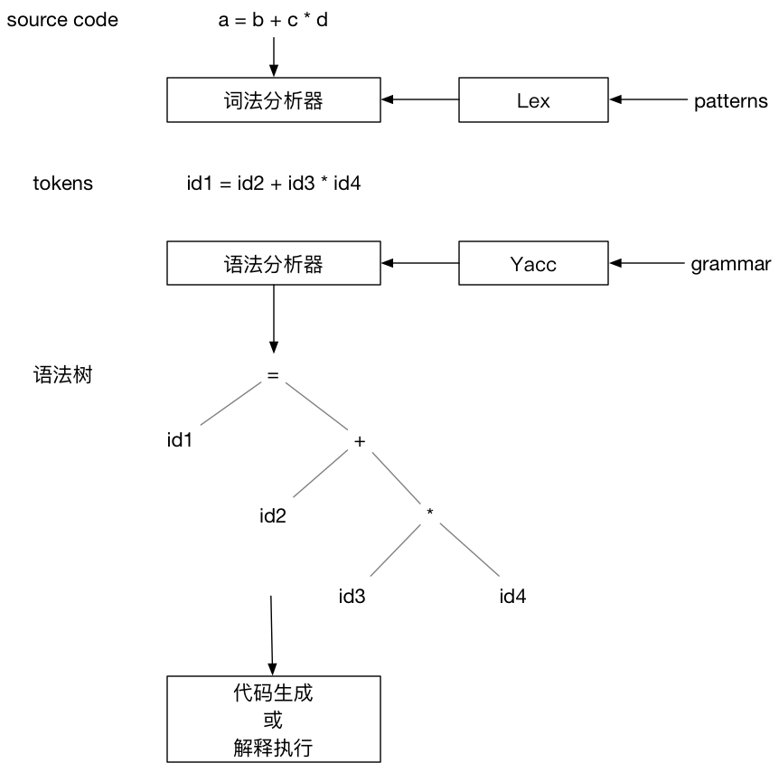

# TiDB Source Code Reading Series Part 5: SQL Parser Implementation

This article is the fifth in the TiDB source code reading series, which explains the implementation of the SQL Parser functionality. The content comes from community contributor Ma Zhen (GitHub ID: mz1999).

> The original intention of writing the TiDB source code reading series is to foster in-depth communication with database researchers and enthusiasts. We are pleased to receive feedback from the community in such a short time. Going forward, we hope more partners will join us in exploring TiDB.

PingCAP has released the [TiDB source code reading series articles](https://cn.pingcap.com/blog/tag/tidb-source-code-reading/), allowing us to learn about TiDB's internal implementation more systematically. The most recent article, ["The Life of a SQL Statement"](https://cn.pingcap.com/blog/tidb-source-code-reading-3), explained the overall processing of a SQL statement - from receiving data over the network, through MySQL protocol analysis and conversion, SQL grammar analysis, query plan formulation and optimization, query plan implementation, to finally returning results.


Among these components, the `SQL Parser` function analyzes SQL statements according to SQL grammar rules and converts the text into an abstract syntax tree (`AST`). This part of the functionality requires some background knowledge to better understand. I'll try to introduce the relevant knowledge, hoping it will be helpful for reading this part of the code.

TiDB uses [goyacc](https://github.com/cznic/goyacc) to generate the SQL grammar analyzer according to the predefined grammar rules document [parser.y](https://github.com/pingcap/tidb/blob/source-code/parser/parser.y). We can see this process in TiDB's [Makefile](https://github.com/pingcap/tidb/blob/50e98f427e7943396dbe38d23178b9f9dc5398b7/Makefile#L50), where it first builds the `goyacc` tool, then uses `goyacc` to generate the parser according to `parser.y` to create `parser.go`.

## Lex & Yacc Introduction

Lex & Yacc are tools used to generate lexical analyzers and grammar analyzers, and their appearance has simplified compiler writing. `Lex & Yacc` were developed at Bell Labs by [Mike Lesk](https://en.wikipedia.org/wiki/Mike_Lesk) and [Stephen C. Johnson](https://en.wikipedia.org/wiki/Stephen_C._Johnson) in 1975. For Java programmers, [ANTLR](https://www.antlr.org/) might be more familiar. `ANTLR 4` provides `Listener` + `Visitor` combined interfaces, which don't require embedding `actions` in grammar definitions to decouple application code and grammar definitions. `Spark` SQL analysis uses `ANTLR`. While `Lex & Yacc` might seem relatively old and less elegant to implement, we only need to understand the grammar definition document and how the generated analyzer works.

Let's start with a simple example:



The above diagram describes the process of building a translator using `Lex & Yacc`. `Lex` generates a lexical analyzer based on user-defined `patterns`. The lexical analyzer reads source code and converts it to `tokens` according to the `patterns`. `Yacc` generates a grammar analyzer according to user-defined grammar rules. The grammar analyzer takes the `tokens` output by the lexical analyzer as input and creates a syntax tree according to the grammar rules. Finally, the syntax tree can be used to generate output results, which can be machine code or interpreted and executed through the `AST`.

## TiDB's SQL Parser Implementation

TiDB's word analysis uses a [handwritten parser](https://github.com/pingcap/tidb/blob/source-code/parser/lexer.go) (for performance considerations), while grammatical interpretation uses `goyacc`. The SQL grammar rule file [parser.y](https://github.com/pingcap/tidb/blob/source-code/parser/parser.y) contains over 6,500 lines.

The data structures related to abstract syntax trees are defined in the [ast](https://github.com/pingcap/tidb/tree/source-code/ast) package, with most implementing the [ast.Node](https://github.com/pingcap/tidb/blob/73900c4890dc9708fe4de39021001ca554bc8374/ast/ast.go#L29) interface:

```go
type Node interface {
    Accept(v Visitor) (node Node, ok bool)
    Text() string
    SetText(text string)
}
```

This interface has an `Accept` method that takes a `Visitor` parameter. Subsequent `AST` processing mainly relies on this `Accept` method to traverse the nodes and perform structural conversions using the Visitor pattern.

For example, [plan.preprocess](https://github.com/pingcap/tidb/blob/source-code/plan/preprocess.go) performs `AST` pre-processing, including legality checks and name binding.

## Author Introduction

Ma Zhen is an architect at Jinyi Tianyan, who was previously responsible for middleware and big data platform development. He has recently moved into the NewSQL field, focusing on OLTP/AP integration, and is currently promoting the adoption of TiDB as a database storage service for the next generation of Jinyi.

Click to see more [TiDB source code reading series articles](https://cn.pingcap.com/blog/tag/tidb-source-code-reading/) 
