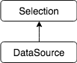
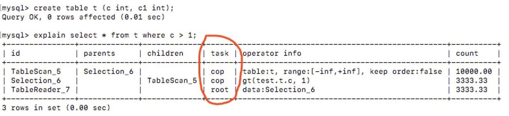

# TiDB Source Code Reading Series Part 6: Overview of Select Statements

In the previous [TiDB source code reading series article (Part 4)](https://cn.pingcap.com/blog/tidb-source-code-reading-4), we introduced the Insert statement. Now that you understand how TiDB writes data, this article will explain how Select statements are executed. Compared to Insert, the execution process of Select statements is more complex, and this article will introduce the optimizer and Coprocessor modules for the first time.

## Table Structure and Statements

The table structure follows the previous article. For Select statements, we'll only explain the simplest scenario: full table scanning + filtering, temporarily ignoring complex situations such as indexing. More complex scenarios will be introduced in subsequent chapters. The example statement is:

```sql
SELECT name FROM t WHERE age > 10;
```

## Statement Processing

Compared to Insert's processing, Select's processing has three notable differences:

1. **Needs Optimization**
   - Insert is a relatively simple statement with limited query plan options (for Insert-Into-Select statements, only the Select part is optimized)
   - Select statements can be extremely complex, and the performance of different query plans varies significantly
   - Careful optimization is required

2. **Requires Interaction with Storage Engine's Computing Module**
   - Insert statements only involve Key-Value operations
   - Select statements may require processing large amounts of data
   - Using the KV interface would be inefficient for the storage engine
   - Calculation logic must be pushed down to storage nodes

3. **Must Return Result Set Data to Client**
   - Insert statements only need to return success status and number of rows inserted
   - Select statements need to return the complete result set

This article will highlight these differences, while simplifying the explanation of shared steps.

## Parsing

[Select's grammar parsing rules](https://github.com/pingcap/tidb/blob/source-code/parser/parser.y#L3906) are much more complex than Insert's. You can refer to the [MySQL documentation](https://dev.mysql.com/doc/refman/5.7/en/select.html) for specific analysis. Pay special attention to the From field, which can be very complex.

The statement is parsed into an [ast.SelectStmt](https://github.com/pingcap/tidb/blob/source-code/ast/dml.go#L451) structure:

For our example statement `SELECT name FROM t WHERE age > 10;`:
- `name` is analyzed as the Fields field
- `WHERE age > 10` is analyzed as the Where field
- `FROM t` is analyzed as the From field

## Planning

In the [planBuilder.buildSelect()](https://github.com/pingcap/tidb/blob/source-code/plan/logical_plan_builder.go#L1452) method, we can see how ast.SelectStmt is converted into a plan tree. The result is a LogicalPlan, where each grammatical element is converted into a logical query plan unit. For example, `WHERE c > 10` becomes a plan.LogicalSelection structure:

The specific structure looks like this:

The most important part is the condition field, which represents the expression that the Where clause needs to evaluate. When this expression evaluates to True, it indicates that the row is eligible.

After buildSelect(), the AST becomes a tree-like Plan structure, which will be optimized in the next step.

## Optimization

Let's look at the [plan.Optimize() function](https://github.com/pingcap/tidb/blob/source-code/plan/optimizer.go#L61). Since the Plan from the Select statement is a LogicalPlan, it enters the doOptimize function [here](https://github.com/pingcap/tidb/blob/source-code/plan/optimizer.go#L81). This function is relatively short:

Pay attention to two steps: logicalOptimize and dagPhysicalOptimize, which represent logical optimization and physical optimization respectively.

### Logical Optimization

Logical optimization consists of a series of optimization rules applied in order to the imported LogicalPlan Tree. See the [logicalOptimize() function](https://github.com/pingcap/tidb/blob/source-code/plan/optimizer.go#L131):

TiDB currently supports the following optimization rules:

These rules don't consider data distribution and operate directly on the Plan tree. Most rules result in a better plan when applied (however, one rule above isn't necessarily better - can you figure out which one?).

Let's look at one rule as an example. The columnPruner (pruning) rule eliminates unnecessary columns. Consider this SQL: `select c from t;`. For the `from t` table scan operation (or potentially an index scan), it only needs to return data from column c. This is achieved by this pruning rule. The entire Plan tree is traversed from root to leaf nodes, with each node retaining only the columns required by nodes above it.

After logical optimization, we get a query plan like this:



Here, `FROM t` becomes a DataSource operation, and `WHERE age > 10` becomes a Selection operation. Here's a thinking question: where did the `SELECT name` selection go?

### Physical Optimization

In the physical optimization stage, data distribution is considered to determine how to choose physical operations. For example, with `FROM t WHERE age > 10`, if there's an index on the age field, it needs to consider whether TableScan + Filter or IndexScan would be faster. This choice depends on statistical information - specifically, how much data the condition `age > 10` would filter out.

Let's look at the [dagPhysicalOptimize](https://github.com/pingcap/tidb/blob/source-code/plan/optimizer.go#L148) function:

The Convert2PhysicalPlan here will call the convert2PhysicalPlan method of lower nodes, generate physical operations and estimate their costs, then select the least costly plan. These two functions are important:

The return value of the above methods is a structure called task, not a physical plan. Here we introduce the concept of **Task**. TiDB's optimizer wraps PhysicalPlan into Task. Task is defined in [task.go](https://github.com/pingcap/tidb/blob/source-code/plan/task.go). Let's look at the comments:

In TiDB, Task is defined as a series of operations that can be executed at a single node without requiring data exchange with other nodes. Currently, only two Tasks are implemented:

- CopTask: A physical plan that needs to be pushed down to the storage engine (TiKV) for computation. Each TiKV node that receives the request will perform the same operation
- RootTask: The part of the physical plan that is kept in TiDB for computation

If you understand TiDB's Explain results, you can see which Task each Operator indicates:



The whole process uses a tree-shaped dynamic programming algorithm. You can study the relevant code yourself or wait for subsequent articles.

After the entire optimization process, we have a physical query plan. For our example statement `SELECT name FROM t WHERE age > 10;`, the query plan looks something like this:


You might wonder where the `WHERE age > 10` condition went. Actually, the `age > 10` filtering condition was merged into PhysicalTableScan because this expression can be pushed down to TiKV for computation, so the TableScan and Filter operations are combined. Which expressions can be pushed down to TiKV's Coprocessor module for computation? For this Query, it's determined [here](https://github.com/pingcap/tidb/blob/source-code/plan/predicate_push_down.go#L72):

In the `expression.ExpressionsToPB` method, expressions that can be pushed down to TiKV are identified (TiKV hasn't implemented all expressions yet, especially built-in functions are only partially implemented) and placed in the DataSource.pushedDownConds field. Next, let's see how DataSource becomes PhysicalTableScan in the [DataSource.convertTableScan()](https://github.com/pingcap/tidb/blob/source-code/plan/physical_plan_builder.go#L523) method. This method builds PhysicalTableScan and calls the [addPushDownSelection()](https://github.com/pingcap/tidb/blob/source-code/plan/physical_plan_builder.go#L610) method to add a PhysicalSelection to PhysicalTableScan and put them together in copTask.

This query plan is very simple, but we can use it to explain how TiDB performs query operations.

## Execution

How a query plan becomes an executable structure and how this structure drives query execution has been described in previous articles. In this section, we'll focus on the specific execution process and TiDB's distributed implementation framework.

### Coprocessor Framework

The Coprocessor concept is borrowed from HBase. In short, it's computation logic injected into the storage engine that waits for calculation requests (serialized physical execution plans) from the SQL layer, processes local data, and returns calculation results. In TiDB, computation is performed at the Region level. The SQL layer analyzes the Key Range of data to be processed, divides these Key Ranges based on Region information obtained from PD, and finally sends requests to the corresponding Regions.

The SQL layer aggregates results returned from multiple Regions and processes them through required Operators to generate the final result set.

#### DistSQL

There's complex processing logic for request distribution and result aggregation, such as error retry, routing information access, concurrency control, and result return. To avoid this complex logic in the SQL layer, TiDB abstracts a unified distributed Query interface called DistSQL API, located in the [distsql](https://github.com/pingcap/tidb/blob/source-code/distsql/distsql.go) package.

The most important method is the [SelectDAG](https://github.com/pingcap/tidb/blob/source-code/distsql/distsql.go#L305) function:

We'll temporarily skip the specific logic in TiKV Client and focus on how the SQL layer reads data from this `selectResult` afterward. The following interface is key:

The selectResult implements the SelectResult interface, which represents an abstraction of all query results. Since computation is Region-based, all results here include results from all involved regions. You can read a Chunk of data by calling the Chunk method. By continuously calling NextChunk, you can get all results until Chunk's NumRows returns 0. The NextChunk implementation will continue getting SelectResponses returned by each Region and write results into Chunk.

#### Root Executor

Currently, calculation requests that can be pushed to TiKV include TableScan, IndexScan, Selection, TopN, Limit, and PartialAggregation. Other more complex calculations still need to be processed on a single tidb-server. So the overall computation follows a multi-tikv-server parallel processing + single tidb-server aggregation model.

## Summary

The two most complex aspects of Select statement processing are query optimization and distributed execution. Both parts will be covered in more detail in subsequent articles. The next article will deviate from specific SQL logic to explain how to understand a particular module.

> Click to see more [TiDB source code reading series articles](https://cn.pingcap.com/blog/tag/tidb-source-code-reading/) 
