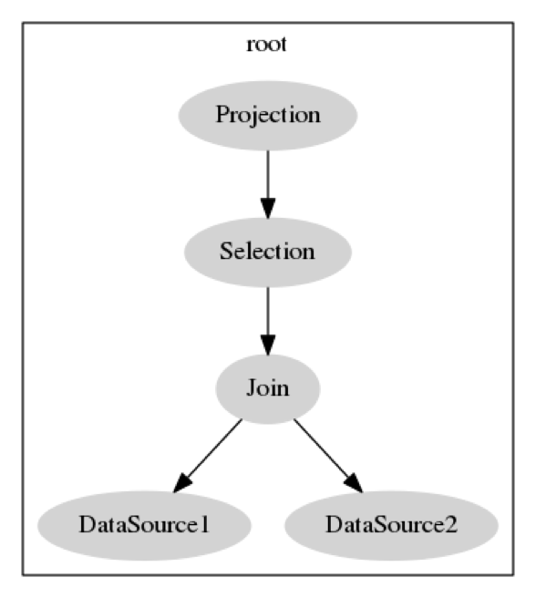

# TiDB Source Code Reading Series Part 7: Logical Optimization

This article is the seventh in the TiDB source code reading series. In TiDB, the SQL optimization process can be divided into two parts: logical optimization and physical optimization. This article will focus on logical optimization.

## Introduction to Logical Operations

Before discussing specific optimization rules, let's briefly introduce some logical operations in the query plan:

- **DataSource**: This is the data source, which is the table in `select * from t`
- **Selection**: The filtering conditions, such as the WHERE clause in `select xxx from t where xx = 5`
- **Projection**: The projection operation, such as column c in `select c from t`
- **Join**: The connection operation, such as joining tables t1 and t2 in `select xx from t1, t2 where t1.c = t2.c`

Selection, Projection, and Join (SPJ for short) are the most basic operations. Among them, Join includes inner join, left/right outer join, and many other join types.

For example, consider this SQL:
```sql
select b from t1, t2 where t1.c = t2.c and t1.a > 5
```

After becoming a logical query plan:
- The DataSource corresponding to t1 and t2 is responsible for capturing the data
- Join calculations above, connecting the results of the two tables using `t1.c = t2.c`
- Selection filter using `t1.a > 5`
- Finally listing column b

The following figure shows an unoptimized representation:



Other operations include:
- **Sort**: The `order by` operation in `select xx from xx order by`
- **Aggregation**: In `select sum(xx) from xx group by yy`, the `group by` operation groups by certain columns. After grouping, you may have aggregation functions like Max/Min/Sum/Count/Average. This example uses sum.
- **Apply**: This is for subqueries.

## Column Pruning

The idea of column pruning is simple: there's no need to read data for unused columns, which would waste IO resources. For example, if a table t has four columns:

```sql
select a from t where b > 5
```

Obviously, only columns a and b are used in this query, so we don't need to read data for columns c and d. In the query plan, Selection operations list column b. Next, DataSource uses only columns a and b, and the remaining c and d can be pruned. DataSource doesn't need to read them when fetching data.

The column pruning algorithm works top-down. The columns a node needs to use equals the columns it needs plus the columns its parent node needs. Moving down the tree, nodes will use more and more columns. The code is in the `plan/column_pruning.go` file.

Column pruning mainly affects Projection, DataSource, and Aggregation operations since they directly relate to columns. Projection will prune unused columns, and DataSource will also prune unused columns.

What columns will Aggregation operations involve? The columns used in `group by` and the columns referenced in aggregate functions. For example, in `select avg(a), sum(b) from t group by c d`, the `group by` uses columns c and d, while aggregate functions use columns a and b. So this Aggregation uses all four columns a, b, c, and d.

For Selection pruning, it depends on which columns the parent node needs and which columns are used in its own conditions. Sort just looks at which columns are used in `order by`. Join must include all columns used in join conditions. In the code, all operations implement the PruneColumns interface.

After the pruning step, query plan operations only record the columns they actually need to use.

## Max/Min Elimination

Max/Min elimination involves rewriting Min/Max statements. For example:

```sql
select max(id) from t
```

We can achieve similar effects using another approach:

```sql
select id from t order by id desc limit 1
```

What are the benefits of this rewrite? The first query's execution plan is an Aggregation on TableScan, meaning it's a full table scan operation. The second query generates a TableScan + Sort + Limit execution plan.

In some cases, such as when id is the primary key or has an index, the data is already ordered, so Sort can be eliminated. It eventually becomes TableScan or IndexLookUp with a Limit, meaning you don't need to scan the full table - just read the first piece of data to get the result! The performance difference between scanning one row versus the entire table is significant.

Max/Min elimination allows the SQL optimizer to perform this transformation automatically.

The resulting query tree will be converted as follows:

This transformation is more complex when handling NULL values. After this transformation step, other changes may be applied. So the extra operations generated in the middle may continue to be modified in other transformations.

Min follows a similar statement replacement pattern. The corresponding code is in the `max_min_eliminate.go` file. The implementation is a pure modification of the AST structure.

## Projection Elimination

Projection elimination can remove unnecessary Projection operations. So, under what circumstances can projection operations be eliminated?

First, if the Projection operation is about to project columns that are exactly the same as its child node's output columns, then the projection step is redundant and can be eliminated. For example, in `select a,b from t`, if table t happens to output columns a and b, then there's no need for TableScan to do another Projection.

Second, if a Projection operation's child node is another Projection operation, then the child node's projection is meaningless and can be eliminated. For example, in `Projection(A) -> Projection(A,B,C)`, keeping just `Projection(A)` is sufficient.

Similarly, in projection elimination rules, Aggregation and Projection operations are very similar. Since the output from an Aggregation node is specific, in `Aggregation(A) -> Projection(A,B,C)`, this Projection can also be eliminated.

The code is in the `eliminate_projection.go` file.

Note the `canEliminate` parameter - it indicates whether the operation is in a "context" that allows elimination. For example, in `Projection(A) -> Projection(A, B, C)` or `Aggregation -> Projection`, when recursing to the child Projection, that Projection is in a `canEliminate` context.

To simply explain whether a Projection node can be eliminated:
- On one hand, its parent node tells it whether it's a redundant Projection operation
- On the other hand, it compares with its child nodes' input columns - if the output is the same, it can be eliminated

## Predicate Pushdown

Predicate pushdown is a very important optimization. For example:

```sql
select * from t1, t2 where t1.a > 5
```

Suppose t1 and t2 each have 100 rows. If we first do a Cartesian product of the two tables and then filter, we have to process 10,000 rows. But if we can apply the filtering conditions first, the amount of data will be greatly reduced. Predicate pushdown means pushing filtering conditions as close to the leaf nodes as possible, thereby reducing data access and saving computation costs.

The interface function for predicate pushdown looks like this:

The PredicatePushDown function processes the current query plan p, with parameter predicates indicating the filtering conditions to be added. The function returns conditions that cannot be pushed down, as well as the newly generated plan.

This function will push down conditions that can be pushed as much as possible, and conditions that cannot be pushed down will be made into a Selection operation, which will then be connected to node p to form a new plan. For example, given conditions `a > 3 AND b = 5 AND c < d`, a > 3 and b = 5 might be pushed down, while c < d remains as a Selection.

Let's look at how Join operations handle predicate pushdown. The code is in the `plan/predicate_push_down.go` file.

First, a simplification is made to convert left outer joins and right outer joins into inner joins.

Under what circumstances can outer joins be converted to inner joins? The result set of a left outer join includes all rows from the left table, not just rows matched by the join columns. If a row from the left table doesn't match any rows from the right table, NULL values are added for the right side in the result set. When pushing down predicates, if we know that subsequent predicate conditions will definitely filter out all rows containing NULL, then it's meaningless to do an outer join - it can be directly rewritten as an inner join.

What will filter out NULL? For example:
- An expression evaluating NULL will get false or NULL
- Multiple conditions connected by AND, where one will filter NULL
- Multiple conditions connected by OR, where each will filter NULL

In terms, the OR condition connection is called DNF (disjunctive normal form). The corresponding AND connection is CNF (conjunctive normal form). These abbreviations are used in TiDB's code.

Examples that can be converted to inner join:
```sql
select * from t1 left join t2 on t1.a = t2.a where t2.b > 5
select * from t1 left join t2 on t1.a = t2.a where t2.b is not null
```

Examples that cannot be converted to inner join:
```sql
select * from t1 left join t2 on t1.a = t2.a where t2.b > 5 or t2.b is null
```

Next, collect all conditions and distinguish between:
- Join equivalence conditions
- Conditions that Join needs to use
- Conditions that all come from left nodes
- Conditions that all come from right nodes

After the distinction, for inner joins, left and right conditions can be pushed down to left and right nodes. The equivalence conditions and other conditions remain in the current Join operations, and the rest are returned.

Predicate pushdown cannot push through MaxOneRow and Limit nodes. This is because doing Limit N first then Selection gives different results than doing Selection first then Limit N. For example, with data 1 to 100, first Limit 10 then Select > 5 gets 5 to 10, while Select > 5 first then Limit gets 5 to 15. MaxOneRow is similar, having the same effect as Limit 1.

DataSource is very simple and will directly add filtering conditions to CopTask. Finally, it will be handled by coprocessor in TiKV.

## Node Properties

In the `build_key_info.go` file, unique key and MaxOneRow attributes will be constructed. This step is not for optimization but builds information needed during optimization.

`build_key_info` collects information about unique indexes. We know some columns are primary keys or unique index columns. In these cases, there won't be multiple identical values in these columns. Only leaf nodes record this information. `build_key_info` passes this information from leaf nodes to all nodes on the LogicalPlan tree, so each node knows these attributes.

For DataSource, primary key columns and unique index columns are unique keys. Pay attention to handling NULL - it needs to be marked with NotNull.

For Projection, the unique index information in its child nodes intersects with its projection expression. For example, if columns a, b, c form a unique index, and column b is projected, the output b column still has the unique value attribute.

If a node's output must be exactly one row, this node will set up a MaxOneRow attribute. In which cases will a node output exactly one row?

- If a node's child nodes are MaxOneRow
- If it's Limit 1, MaxOneRow can be set
- If it's Selection, and the filtering condition is that a unique index column equals a constant
- For Join operations, if both its left and right nodes have MaxOneRow attributes

## Summary

This article covered rule-based optimization (RBO), introducing the basic operations in logical query plans and some optimization rules. Future articles will introduce more optimization rules and cost-based optimization (CBO).

> Click to see more [TiDB source code reading series articles](https://cn.pingcap.com/blog/tag/tidb-source-code-reading/) 
