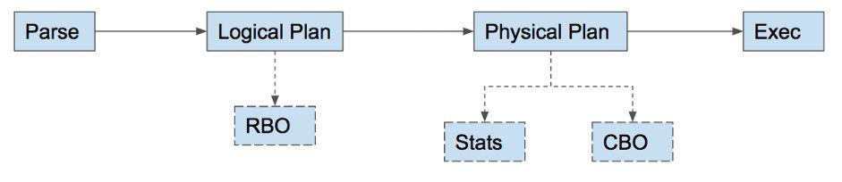
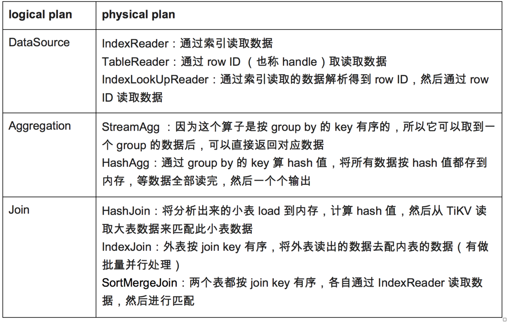
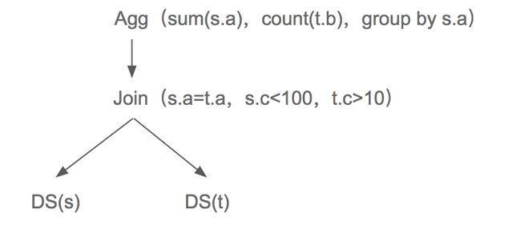
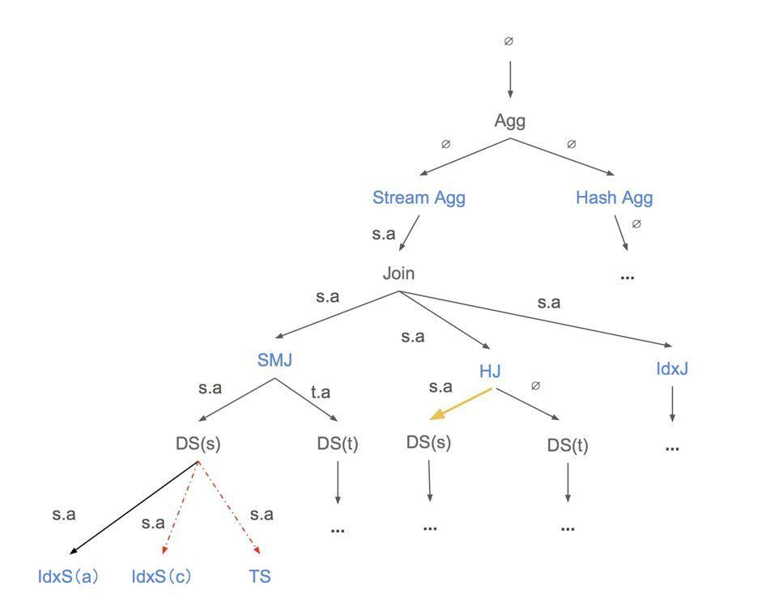
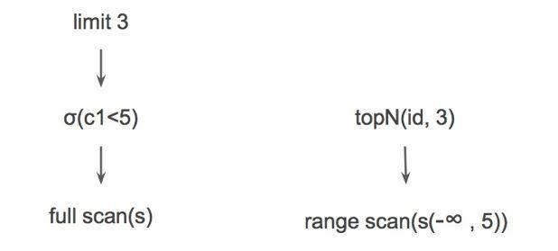

# TiDB Source Code Reading Series Part 8: Cost-Based Optimization

This article is the eighth in the TiDB source code reading series. We will first briefly introduce the process of query plan formulation and optimization, and then provide a detailed explanation of the Cost-Based Optimization (CBO) process after obtaining the logical plan.

## Overview

This article is part of the TiDB source code reading series. We will first introduce the process of query plan formulation and optimization, then provide a detailed explanation of how various physical plans are generated based on statistical information and different attribute choices after obtaining the logical plan. Through comparing the costs of physical plans, we ultimately select a cost-effective physical plan - the Cost-Based Optimization (CBO) process.

## Optimizer Framework

General optimizers use a two-stage optimization approach:
1. Rule-Based Optimization (RBO)
2. Cost-Based Optimization (CBO)

TiDB divides plan optimization into two modules:

- Logical optimization: Primarily based on relational algebra equivalent exchange rules to make logical changes
- Physical optimization: Mainly optimized through data reading and querying methods, table join methods, table join order, sorting, and other techniques

Compared to RBO, CBO depends on the accuracy and timeliness of statistical information, and the implementation plan will be adjusted in real-time according to data changes.

## Optimizer Process

TiDB's simple process for query statements follows these steps:
1. A statement gets an abstract syntax tree (AST) after parsing
2. Generates a logical plan from AST after legality checks
3. Performs rule optimizations like decorrelation, predicate pushdown, etc.
4. Selects the optimal physical plan by calculating costs using statistical data
5. Executes the plan



### Introduction to Physical Computing

As previously introduced in the physical layer optimization approach, the same logical operation may generate multiple different physical operations due to different data reading and calculation methods. For example, the logical Join operation can be converted into physical operations choosing between HashJoin, SortMergeJoin, or IndexLookupJoin.

Here we'll briefly introduce some physical operators that logical operators can choose from. For example, consider the statement: `select sum(*) from t join s on t.c = s.c group by a`. This statement contains logical operators like DataSource, Aggregation, Join, and Projection. Let's look at some typical logical operators and their corresponding physical operators:



## CBO Process

The main idea of cost-based optimization is to calculate the costs of all possible execution plans and select the path with the minimum cost. Working backward, we first need to:
1. Collect statistical information for the relevant tables
2. Calculate the execution cost of each operator
3. Accumulate the costs of operators along each path to find the path with minimum cost

The specific code implementation is in the `dagPhysicalOptimize` function in `plan/optimizer.go`. The process described in this article is primarily handled by this function.

### Overall Process

We'll first describe the entire CBO process. The main framework logic is in the file `plan/physical_plan_builder.go`, specifically in the `convert2PhysicalPlan` function.

### Example

To better understand the CBO process, let's walk through an example.

First, let's introduce the concept of "required property". This is an important concept that represents requirements for operator return data. For example, if we want some operators to return data sorted by certain columns, we pass the corresponding column information. If there are no requirements, we pass an empty property.

Let's look at an example SQL query:

```sql
select sum(s.a) from t join s on t.a = s.a group by a
```

(where `a` and `b` are both indexes)

This statement performs a join between tables s and t based on the ON condition, then performs aggregation on the join result. Here's the logical representation (omitting the Projection operator for comparison with the next diagram):



After obtaining the logical operators, how do we choose the optimal physical operators?

TiDB uses memoization search to handle this. There isn't much difference between bottom-up and top-down searching, but we chose top-down because:
1. It's easier to understand
2. Passing properties from parent to children can reduce some possibilities (this will be explained in detail later)

Let's examine the operator generation and selection process for this example. Initially, the property is empty, with no requirements for the Agg operator. Next, we construct physical operators based on all possible properties for the current logical operator. Agg can generate Stream Agg and Hash Agg (implemented in the `genPhysPlansByReqProp` function). Stream Agg requires ordering by group by key (column a), so its child's property will include column a. Hash Agg has no requirements, so its property is empty.

When Stream Agg's child is Join, Join corresponds to 3 physical operators: SortMerge Join (SMJ), Hash Join (HJ), and Index Join (IdxJ). SMJ requires ordering by join key, so when constructing DS (DataSource), table s needs to be ordered by s.a and table t by t.a. So when building DS into physical operators, although there are IdxScan(a), IdxScan(b), and TableScan(TS), only IdxScan(a) satisfies the property(s.a) requirement. In this example, only IdxScan(a) meets the requirements and is returned to SMJ. If there were other operators that satisfied the requirements, cost would be used to select between them (this will be covered in "Cost Evaluation").

Using memoization search, we hash the property of each operator and store it in a hash table, so when calculating DS(s) for HJ (path with yellow arrow), we find that DS(s) under SMJ has already been calculated and can directly use that value without redundant computation.

Due to space limitations, we've only described the left path. In this example, the final layer comparison is between `HA + HJ + idx(c)` and `SA + MJ + idx(a)`, with the optimal solution selected through cost calculation using statistical information.



(Black text represents logical operators, blue text represents physical operators, yellow arrows indicate operators whose costs have already been calculated and cached in the hash table, and red dashed arrows indicate operators that don't meet property requirements.)

## Cost Evaluation

The cost evaluation logic is in `plan/physical_plan_builder.go`.

### Statistical Information

Let's detail how statistical information is used in the CBO process. The specific methods and process of collecting statistical information will be covered in a future article.

A statsInfo structure has two fields:
- count: Represents the number of data rows in a table (one value per table)
- cardinality: Represents the number of distinct data rows for each column (one per column)

Cardinality is generally obtained through statistical data, specifically the DNV (number of distinct values) value for the corresponding column in the corresponding table's statistics. There are two ways to get this data:

1. From the histogram of the corresponding column in the corresponding table's statistics
2. Using an estimated value when statistical data hasn't been collected yet

(statsTable.count is updated periodically based on stats lease, while histogram.count is only updated when users manually analyze)

For example, let's look at how statsInfo is obtained for two operators:

1. DataSource:
   - First gets count and cardinality through the two formulas mentioned above
   - Then uses pushdown expressions to calculate selectivity: `selectivity = row count after filter / row count before filter`
   - Finally adjusts the original count and cardinality values using the calculated selectivity

2. LogicalJoin (inner join):
   The count formula for this operator is:
   ```
   count = (N1/V1) * (N2/V2) * min(V1, V2)
   ```
   (where N is the number of rows in the table, V is the cardinality value of the key)

This can be understood as the product of the average number of non-unique values in tables s and t multiplied by the number of non-unique rows in the smaller table.

This logic is implemented in the `deriveStats` function in the `stats.go` file.

### Expected Count

Expected count represents the number of rows this operator expects to read before the entire SQL completes. For example, consider the SQL: `select * from s where s.c1 < 5 order by id limit 3` (where c1 is an index column and id is the primary key column). We can get two possible plan paths, as shown in Figure 4.

- In the first case, PhysicalLimit chooses id ordering, so its expected count is 3. Due to the c1 < 5 filter condition, the TableScan's expected count is `min(n(s), 3 / f(σ(c1<5)))`.
- In the second case, although TopN knows it needs to read 3 rows, since it's ordered by the id column, its expected count is Max. At IndexScan, the expected count is `count * f(σ(c1<5))`.



### Task

When evaluating costs, physical operators are associated with a task object structure. Tasks are divided into three types: cop single, cop double, and root. The first two types can be pushed down to the coprocessor for execution. There are two reasons for distinguishing types:
1. It can differentiate whether the corresponding operator is processed by TiDB or pushed down to TiKV's coprocessor
2. More importantly, it helps make cost evaluation more accurate

Let's look at an example SQL:

```sql
select * from t where t.a > 0 and t.b > 0
```
(where (a,b) and (b,a,c) are indexes, and table t has columns a, b, and c)

This can lead to two paths:
1. Case 1: IndexScan(a,b) -> Selection(b > 0)
2. Case 2: IndexScan(b,a) -> Selection(a > 0)

Without distinguishing between cop single and cop double, searching the bottom layer would cause Case 2 to be abandoned prematurely. However, when considering the cost of reading data to TiKV in the first path, it might actually cost more than the second path. By distinguishing between cop single and cop double, we don't compare at the IndexScan level but wait until after selection, making it possible to choose the second plan path. This better reflects the actual situation.

Our common formula for calculating costs:
```
cost = N * network factor + M * memory factor + C * CPU factor
```
(where N represents network expenses, M represents memory expenses, C means CPU expenses, F means factors)

The plan is linked to the task and the cost of this plan is added.

Task processing code is mainly in the `plan/task.go` file.

## Property Pruning

The reason for introducing the property pruning function is to reduce some properties that are not necessary to consider, thereby reducing branches on the search path of the physical plan as early as possible. For example:

```sql
select * from t join s on t.a = s.b and t.b = s.a
```

Its property can be {A, B}, {B, A}.

If we have n equation conditions, we would have n! possible properties. With this operation, we can only use the properties owned by t and s.

Properties are obtained in the logical calculator of DataSource because the corresponding key and index information can be obtained in this calculator.

The logic here is documented in the `PreparePossibleProperties` function in `plan/property_cols_prune.go`.

> Click to see more [TiDB source code reading series articles](https://cn.pingcap.com/blog/tag/tidb-source-code-reading/) 
