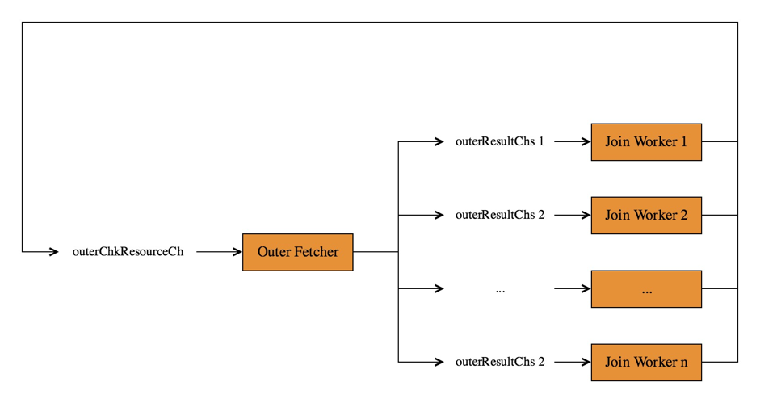
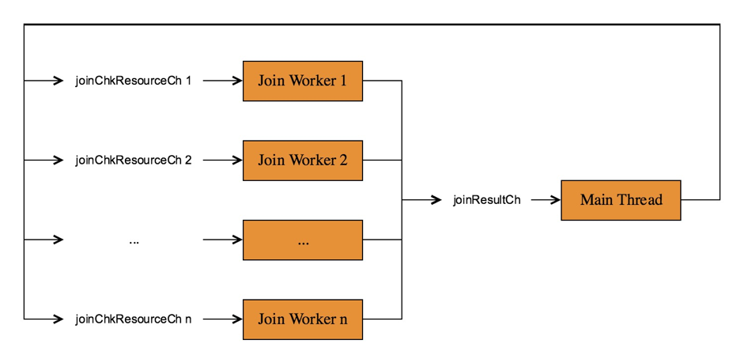

# TiDB Source Code Reading Series Part 9: Hash Join Implementation

This article is the ninth in the TiDB source code reading series. It details the implementation of TiDB's Hash Join and several common problems.

## What is Hash Join?

Hash Join's basic definition can be found on [Wikipedia: Hash join](https://en.wikipedia.org/wiki/Hash_join). Simply put, for Hash Join between Tables A and B, we need to choose one table as the Inner table to construct the hash table, and then scan each row of data in the Outer table to find matching data.

We don't use the terms "small table" and "large table" because: For Outer Join operations like Left Outer Join, regardless of whether the Left table is larger or smaller than the Right table, we must use the Right table as the Inner table and the Left table as our driving table (Outer table). Using "Inner" and "Outer" is more accurate and less confusing. The hash table is built on the Inner table during the Build phase, and the Join process is driven by the Outer table during the Probe phase.

## TiDB Hash Join Implementation

TiDB's Hash Join is implemented as a multi-threaded version. The main tasks are:

- Main Thread (one) performs the following tasks:
  - Read all Inner table data
  - Construct the Hash table from Inner table data
  - Start Outer Fetcher and Join Workers for background processing to generate Join results (the startup process for each goroutine is completed in the [`fetchOuterAndProbeHashTable`](https://github.com/pingcap/tidb/blob/source-code/executor/join.go#L1003) function)
  - Return Join results calculated by Join Workers through the `NextChunk` interface

- Outer Fetcher (one) is responsible for reading Outer table data and distributing it to various Join Workers

- Join Workers (multiple) are responsible for probing the hash table, matching Inner and Outer tables, and passing results to the Main Thread

Let's examine the various stages of Hash Join in detail.

### Main Thread Reading Inner Table Data

The process of reading Inner table data is completed by the [`fetchInnerRows`](https://github.com/pingcap/tidb/blob/source-code/executor/join.go#L329) function. This process continuously calls the Child `NextChunk` interface and stores each Chunk obtained in [`innerResult`](https://github.com/pingcap/tidb/blob/source-code/executor/join.go#L348) for subsequent calculations.

### Main Thread Constructing Hash Table

The hash table construction process is completed by the [`buildHashTableForList`](https://github.com/pingcap/tidb/blob/source-code/executor/join.go#L1003) function.

The hash table we use (stored in the [`hashTable`](https://github.com/pingcap/tidb/blob/source-code/executor/join.go#L52) variable) is essentially an [`MVMap`](https://github.com/pingcap/tidb/blob/source-code/util/mvmap/mvmap.go#L118). Both Key and Value in MVMap are of type `[]byte`. Unlike ordinary maps, MVMap allows a Key to have multiple Values. This feature is very practical for Hash Join since the same Join Key in a table may correspond to multiple rows of data.

When constructing the hash table, we process each row of data in the Inner table (stored in `innerResult`) as follows:

- Calculate the Join Key data to get a `[]byte` that will serve as the MVMap Key
- Calculate the location information to get another `[]byte` that will serve as the MVMap Value
- Put this `(Key, Value)` pair into the MVMap

### Outer Fetcher

Outer Fetcher is a background goroutine with its main logic in the [`fetchOuterChunks`](https://github.com/pingcap/tidb/blob/source-code/executor/join.go#L291) function.

It continuously reads data from the large table and distributes the Outer table data to various Join Workers. The resource interaction between multiple threads can be illustrated as follows:

Two channels are involved:

- [`outerResultChs[i]`](https://github.com/pingcap/tidb/blob/source-code/executor/join.go#L74): One for each Join Worker, Outer Fetcher writes the obtained Outer Chunk into this channel for the corresponding Join Worker
- [`outerChkResourceCh`](https://github.com/pingcap/tidb/blob/source-code/executor/join.go#L73): When a Join Worker finishes processing its current Outer Chunk, it writes this Chunk and its corresponding outerResultChs[i] address to this channel, telling Outer Fetcher:
  - Here's a Chunk you can reuse to pull Outer data, no need to allocate new memory
  - My Outer Chunk is used up, please send the next batch of Outer data directly to me

**Therefore, Outer Fetcher's overall logic is:**

1. Get an [`outerChkResource`](https://github.com/pingcap/tidb/blob/source-code/executor/join.go#L84) from [`outerChkResourceCh`](https://github.com/pingcap/tidb/blob/source-code/executor/join.go#L73), stored in variable [`outerResource`](https://github.com/pingcap/tidb/blob/source-code/executor/join.go#L307)
2. Pull data from Child and write it into the [`chk`](https://github.com/pingcap/tidb/blob/source-code/executor/join.go#L85) field of [`outerResource`](https://github.com/pingcap/tidb/blob/source-code/executor/join.go#L307)
3. Send this [`chk`](https://github.com/pingcap/tidb/blob/source-code/executor/join.go#L85) to the Join Worker that needs Outer table data via `outerResultChs[i]`, with this information recorded in the [`dest`](https://github.com/pingcap/tidb/blob/source-code/executor/join.go#L86) field of [`outerResource`](https://github.com/pingcap/tidb/blob/source-code/executor/join.go#L307)

### Join Worker

Each Join Worker is a background goroutine with its main logic in the [`runJoinWorker4Chunk`](https://github.com/pingcap/tidb/blob/source-code/executor/join.go#L562) function. The number of Join Workers is controlled by the `tidb_hash_join_concurrency` session variable, defaulting to 5.

Two channels are involved:

- [`joinChkResourceCh[i]`](https://github.com/pingcap/tidb/blob/source-code/executor/join.go#L75): One for each Join Worker, used to store Join results
- [`joinResultCh`](https://github.com/pingcap/tidb/blob/source-code/executor/join.go#L76): Join Workers write their Join result Chunks and joinChkResourceCh addresses into this channel, telling Main Thread:
  - Here's a Join result Chunk you can return to the Next function caller
  - After you're done with this Chunk, return it to me so I can continue working

**Therefore, Join Worker's overall logic is:**

1. Get an Outer Chunk
2. Get a Join Chunk Resource
3. Probe the hash table, writing matching Outer Row and Inner Rows to the Join Chunk
4. Send the completed Join Chunk to Main Thread

### Main Thread

The main thread's calculation logic is in the [`NextChunk`](https://github.com/pingcap/tidb/blob/source-code/executor/join.go#L776) function. Its logic is simple:

1. Get a Join Chunk from [`joinResultCh`](https://github.com/pingcap/tidb/blob/source-code/executor/join.go#L76)
2. Exchange data between the caller's Chunk and the Join Chunk
3. Return the Join Chunk to the corresponding Join Worker

## Hash Join FAQ

### How to Determine Inner and Outer Tables?

- Left Outer Join: Left table is Outer, Right table is Inner
- Right Outer Join: Right table is Outer, Left table is Inner
- Inner Join: The larger table (estimated by optimizer) is Outer, smaller table is Inner
- Semi Join, Anti Semi Join, Left Outer Semi Join, or Anti Left Outer Semi Join: Left table is Outer, Right table is Inner

### NULL Value Handling in Join Keys

`NULL` does not equal `NULL`, so special handling is required.

### Four Types of Filters in Join

- **Filter on Inner**: Currently pushed down to the Hash Join Inner table by the optimizer. This helps filter out unmatched data early at the coprocessor level.

- **Filter on Outer table**: Calculated in [`join2Chunk`](https://github.com/pingcap/tidb/blob/source-code/executor/join.go#L711) by Join Workers. When a Join Worker gets an Outer Chunk, it first applies the Outer Filter before probing the hash table.

- **Equivalence conditions between tables**: These are the Join Keys. For example, if tables A and B have conditions `A.col1=B.col2 and A.col3=B.col4`, then the Join Keys are `(col1, col3)` and `(col2, col4)`.

- **Non-equivalence conditions between tables**: These filters are applied to Join result sets. A row pair is considered matching only if it passes these filters. This filtering is handled by [`joinResultGenerator`](https://github.com/pingcap/tidb/blob/source-code/executor/join_result_generators.go#L36).

### Join Method Implementations

TiDB currently supports 7 Join methods, defined through the [`joinResultGenerator`](https://github.com/pingcap/tidb/blob/source-code/executor/join_result_generators.go#L36) interface:

1. [`semiJoinResultGenerator`](https://github.com/pingcap/tidb/blob/source-code/executor/join_result_generators.go#L212): Implements Semi Join - outputs Outer Row when it matches at least one Inner Row

2. [`antiSemiJoinResultGenerator`](https://github.com/pingcap/tidb/blob/source-code/executor/join_result_generators.go#L278): Implements Anti Semi Join - outputs Outer Row only when it matches no Inner Rows

3. [`leftOuterSemiJoinResultGenerator`](https://github.com/pingcap/tidb/blob/source-code/executor/join_result_generators.go#L342): Implements Left Outer Semi Join - outputs Outer Row + Boolean (true if matches any Inner Row, false otherwise)

4. [`antiLeftOuterSemiJoinResultGenerator`](https://github.com/pingcap/tidb/blob/source-code/executor/join_result_generators.go#L415): Implements Anti Left Outer Semi Join - outputs Outer Row + Boolean (true if matches no Inner Rows, false otherwise)

5. [`leftOuterJoinResultGenerator`](https://github.com/pingcap/tidb/blob/source-code/executor/join_result_generators.go#L490): Implements Left Outer Join - outputs Outer Row + NULL-filled Inner Row if no match, or each matching Outer Row + Inner Row pair

6. [`rightOuterJoinResultGenerator`](https://github.com/pingcap/tidb/blob/source-code/executor/join_result_generators.go#L555): Implements Right Outer Join - outputs NULL-filled Inner Row + Outer Row if no match, or each matching Inner Row + Outer Row pair

7. [`innerJoinResultGenerator`](https://github.com/pingcap/tidb/blob/source-code/executor/join_result_generators.go#L619): Implements Inner Join - outputs nothing for unmatched rows, outputs each matching Inner Row + Outer Row or Outer Row + Inner Row pair

> See more [TiDB source code reading series articles](https://cn.pingcap.com/blog/tag/tidb-source-code-reading/) 
